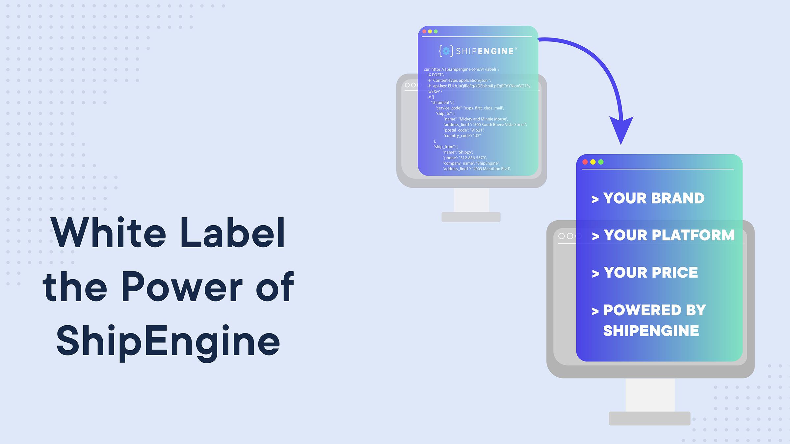

<div align="left">

[](https://shipengine.com)

# [Shipengine](https://shipengine.com)<a id="shipengine"></a>

ShipEngine's easy-to-use REST API lets you manage all of your shipping needs without worrying about the complexities of different carrier APIs and protocols. We handle all the heavy lifting so you can focus on providing a first-class shipping experience for your customers at the best possible prices.

Each of ShipEngine's features can be used by itself or in conjunction with each other to build powerful shipping functionality into your application or service.

## Getting Started<a id="getting-started"></a>
If you're new to REST APIs then be sure to read our [introduction to REST](https://www.shipengine.com/docs/rest/) to understand the basics.  Learn how to [authenticate yourself to ShipEngine](https://www.shipengine.com/docs/auth/), and then use our [sandbox environment](https://www.shipengine.com/docs/sandbox/) to kick the tires and get familiar with our API. If you run into any problems, then be sure to check the [error handling guide](https://www.shipengine.com/docs/errors/) for tips.

Here are some step-by-step **tutorials** to get you started:

  - [Learn how to create your first shipping label](https://www.shipengine.com/docs/labels/create-a-label/)
  - [Calculate shipping costs and compare rates across carriers](https://www.shipengine.com/docs/rates/)
  - [Track packages on-demand or in real time](https://www.shipengine.com/docs/tracking/)
  - [Validate mailing addresses anywhere on Earth](https://www.shipengine.com/docs/addresses/validation/)


## Shipping Labels for Every Major Carrier<a id="shipping-labels-for-every-major-carrier"></a>
ShipEngine makes it easy to [create shipping labels for any carrier](https://www.shipengine.com/docs/labels/create-a-label/) and [download them](https://www.shipengine.com/docs/labels/downloading/) in a [variety of file formats](https://www.shipengine.com/docs/labels/formats/). You can even customize labels with your own [messages](https://www.shipengine.com/docs/labels/messages/) and [images](https://www.shipengine.com/docs/labels/branding/).


## Real-Time Package Tracking<a id="real-time-package-tracking"></a>
With ShipEngine you can [get the current status of a package](https://www.shipengine.com/docs/tracking/) or [subscribe to real-time tracking updates](https://www.shipengine.com/docs/tracking/webhooks/) via webhooks. You can also create [custimized tracking pages](https://www.shipengine.com/docs/tracking/branded-tracking-page/) with your own branding so your customers will always know where their package is.


## Compare Shipping Costs Across Carriers<a id="compare-shipping-costs-across-carriers"></a>
Make sure you ship as cost-effectively as possible by [comparing rates across carriers](https://www.shipengine.com/docs/rates/get-shipment-rates/) using the ShipEngine Rates API. Or if you don't know the full shipment details yet, then you can [get rate estimates](https://www.shipengine.com/docs/rates/estimate/) with limited address info.


## Worldwide Address Validation<a id="worldwide-address-validation"></a>
ShipEngine supports [address validation](https://www.shipengine.com/docs/addresses/validation/) for virtually [every country on Earth](https://www.shipengine.com/docs/addresses/validation/countries/), including the United States, Canada, Great Britain, Australia, Germany, France, Norway, Spain, Sweden, Israel, Italy, and over 160 others.


</div>

## Table of Contents<a id="table-of-contents"></a>

<!-- toc -->

- [Installation](#installation)
- [Getting Started](#getting-started)
- [Reference](#reference)
  * [`shipengine.account.createImage`](#shipengineaccountcreateimage)
  * [`shipengine.account.deleteImageById`](#shipengineaccountdeleteimagebyid)
  * [`shipengine.account.getImageById`](#shipengineaccountgetimagebyid)
  * [`shipengine.account.listImages`](#shipengineaccountlistimages)
  * [`shipengine.account.listSettings`](#shipengineaccountlistsettings)
  * [`shipengine.account.updateImageById`](#shipengineaccountupdateimagebyid)
  * [`shipengine.addresses.address`](#shipengineaddressesaddress)
  * [`shipengine.addresses.address_0`](#shipengineaddressesaddress_0)
  * [`shipengine.batches.addToBatch`](#shipenginebatchesaddtobatch)
  * [`shipengine.batches.batch`](#shipenginebatchesbatch)
  * [`shipengine.batches.batch_0`](#shipenginebatchesbatch_0)
  * [`shipengine.batches.batch_1`](#shipenginebatchesbatch_1)
  * [`shipengine.batches.batch_2`](#shipenginebatchesbatch_2)
  * [`shipengine.batches.batches`](#shipenginebatchesbatches)
  * [`shipengine.batches.getByExternalId`](#shipenginebatchesgetbyexternalid)
  * [`shipengine.batches.getById`](#shipenginebatchesgetbyid)
  * [`shipengine.batches.getErrors`](#shipenginebatchesgeterrors)
  * [`shipengine.batches.removeFromBatch`](#shipenginebatchesremovefrombatch)
  * [`shipengine.carrierAccounts.carrier`](#shipenginecarrieraccountscarrier)
  * [`shipengine.carrierAccounts.carrier_0`](#shipenginecarrieraccountscarrier_0)
  * [`shipengine.carrierAccounts.getSettings`](#shipenginecarrieraccountsgetsettings)
  * [`shipengine.carrierAccounts.updateSettings`](#shipenginecarrieraccountsupdatesettings)
  * [`shipengine.carriers.addFundsToCarrier`](#shipenginecarriersaddfundstocarrier)
  * [`shipengine.carriers.carriers`](#shipenginecarrierscarriers)
  * [`shipengine.carriers.disconnectById`](#shipenginecarriersdisconnectbyid)
  * [`shipengine.carriers.getById`](#shipenginecarriersgetbyid)
  * [`shipengine.carriers.getOptions`](#shipenginecarriersgetoptions)
  * [`shipengine.carriers.listPackageTypes`](#shipenginecarrierslistpackagetypes)
  * [`shipengine.carriers.listServices`](#shipenginecarrierslistservices)
  * [`shipengine.downloads.file`](#shipenginedownloadsfile)
  * [`shipengine.insurance.autoFundAccount`](#shipengineinsuranceautofundaccount)
  * [`shipengine.insurance.getFundsBalance`](#shipengineinsurancegetfundsbalance)
  * [`shipengine.insurance.insurer`](#shipengineinsuranceinsurer)
  * [`shipengine.insurance.insurer_0`](#shipengineinsuranceinsurer_0)
  * [`shipengine.labels.createReturnLabel`](#shipenginelabelscreatereturnlabel)
  * [`shipengine.labels.getByExternalShipmentId`](#shipenginelabelsgetbyexternalshipmentid)
  * [`shipengine.labels.getById`](#shipenginelabelsgetbyid)
  * [`shipengine.labels.getTrackingInfo`](#shipenginelabelsgettrackinginfo)
  * [`shipengine.labels.label`](#shipenginelabelslabel)
  * [`shipengine.labels.label_0`](#shipenginelabelslabel_0)
  * [`shipengine.labels.labels`](#shipenginelabelslabels)
  * [`shipengine.labels.purchaseLabelWithRateId`](#shipenginelabelspurchaselabelwithrateid)
  * [`shipengine.labels.purchaseLabelWithShipmentId`](#shipenginelabelspurchaselabelwithshipmentid)
  * [`shipengine.manifests.getById`](#shipenginemanifestsgetbyid)
  * [`shipengine.manifests.getRequestById`](#shipenginemanifestsgetrequestbyid)
  * [`shipengine.manifests.manifest`](#shipenginemanifestsmanifest)
  * [`shipengine.manifests.manifests`](#shipenginemanifestsmanifests)
  * [`shipengine.packagePickups.getById`](#shipenginepackagepickupsgetbyid)
  * [`shipengine.packagePickups.listScheduledPickups`](#shipenginepackagepickupslistscheduledpickups)
  * [`shipengine.packagePickups.pickup`](#shipenginepackagepickupspickup)
  * [`shipengine.packagePickups.removeScheduledPickup`](#shipenginepackagepickupsremovescheduledpickup)
  * [`shipengine.packageTypes.createCustomPackageType`](#shipenginepackagetypescreatecustompackagetype)
  * [`shipengine.packageTypes.deleteCustomPackageById`](#shipenginepackagetypesdeletecustompackagebyid)
  * [`shipengine.packageTypes.getById`](#shipenginepackagetypesgetbyid)
  * [`shipengine.packageTypes.listCustomPackageTypes`](#shipenginepackagetypeslistcustompackagetypes)
  * [`shipengine.packageTypes.updateCustomPackageTypeById`](#shipenginepackagetypesupdatecustompackagetypebyid)
  * [`shipengine.rates.getBulkShipmentRates`](#shipengineratesgetbulkshipmentrates)
  * [`shipengine.rates.getById`](#shipengineratesgetbyid)
  * [`shipengine.rates.rates`](#shipengineratesrates)
  * [`shipengine.rates.rates_0`](#shipengineratesrates_0)
  * [`shipengine.servicePoints.getById`](#shipengineservicepointsgetbyid)
  * [`shipengine.servicePoints.getByLocation`](#shipengineservicepointsgetbylocation)
  * [`shipengine.shipments.getByExternalId`](#shipengineshipmentsgetbyexternalid)
  * [`shipengine.shipments.getById`](#shipengineshipmentsgetbyid)
  * [`shipengine.shipments.getRatesForShipment`](#shipengineshipmentsgetratesforshipment)
  * [`shipengine.shipments.getTagsById`](#shipengineshipmentsgettagsbyid)
  * [`shipengine.shipments.shipment`](#shipengineshipmentsshipment)
  * [`shipengine.shipments.shipment_0`](#shipengineshipmentsshipment_0)
  * [`shipengine.shipments.shipment_1`](#shipengineshipmentsshipment_1)
  * [`shipengine.shipments.shipment_2`](#shipengineshipmentsshipment_2)
  * [`shipengine.shipments.shipments`](#shipengineshipmentsshipments)
  * [`shipengine.shipments.shipments_0`](#shipengineshipmentsshipments_0)
  * [`shipengine.shipments.shipments_1`](#shipengineshipmentsshipments_1)
  * [`shipengine.shipments.updateTags`](#shipengineshipmentsupdatetags)
  * [`shipengine.tags.tag`](#shipenginetagstag)
  * [`shipengine.tags.tag_0`](#shipenginetagstag_0)
  * [`shipengine.tags.tag_1`](#shipenginetagstag_1)
  * [`shipengine.tags.tags`](#shipenginetagstags)
  * [`shipengine.tokens.generateEphemeralToken`](#shipenginetokensgenerateephemeraltoken)
  * [`shipengine.tracking.infoRetrieval`](#shipenginetrackinginforetrieval)
  * [`shipengine.tracking.tracking`](#shipenginetrackingtracking)
  * [`shipengine.tracking.tracking_0`](#shipenginetrackingtracking_0)
  * [`shipengine.warehouses.getById`](#shipenginewarehousesgetbyid)
  * [`shipengine.warehouses.updateSettings`](#shipenginewarehousesupdatesettings)
  * [`shipengine.warehouses.warehouse`](#shipenginewarehouseswarehouse)
  * [`shipengine.warehouses.warehouse_0`](#shipenginewarehouseswarehouse_0)
  * [`shipengine.warehouses.warehouse_1`](#shipenginewarehouseswarehouse_1)
  * [`shipengine.warehouses.warehouses`](#shipenginewarehouseswarehouses)
  * [`shipengine.webhooks.getById`](#shipenginewebhooksgetbyid)
  * [`shipengine.webhooks.webhook`](#shipenginewebhookswebhook)
  * [`shipengine.webhooks.webhook_0`](#shipenginewebhookswebhook_0)
  * [`shipengine.webhooks.webhook_1`](#shipenginewebhookswebhook_1)
  * [`shipengine.webhooks.webhooks`](#shipenginewebhookswebhooks)

<!-- tocstop -->

## Installation<a id="installation"></a>
<div align="center">
  <a href="https://konfigthis.com/sdk-sign-up?company=ShipEngine&language=TypeScript">
    
  </a>
</div>

## Getting Started<a id="getting-started"></a>

```typescript
import { ShipEngine } from "ship-engine-typescript-sdk";

const shipengine = new ShipEngine({
  // Defining the base path is optional and defaults to https://api.shipengine.com
  // basePath: "https://api.shipengine.com",
  apiKey: "API_KEY",
});

const createImageResponse = await shipengine.account.createImage({
  label_image_id: "img_DtBXupDBxREpHnwEXhTfgK",
  name: "My logo",
  is_default: false,
  image_content_type: "image/png",
  image_data:
    "iVBORw0KGgoAAAANSUhEUgAAABkAAAAZCAYAAADE6YVjAAAAAXNSR0IArs4c6QAAAiVJREFUSEu91j3IeVEcB/CvSTIoBrFSikEZMdjsjExeUspgUEp5SUpeshrIgEFJJmWwMZHJQGHDhJSXTPfpnH/8ebzd56HnN93u7ZzP/f1+55x7Ob1ejxEKheByufh0HI9HrFYrcKbTKUMu5HI5BALBx5zNZoPxeAySAGc2mzF8Pp/e+BR0Ash8u93uHyKVSnH54J2Mvs8zn8//I6RO70L3xt8g70CPXvAu8hvoWQUeIj+BXpX4KcIGegWQOV4izyA2AGvkHsQW+BFyCUkkEiwWC9Ybl1W5Ls8ZMoAABCIbmE3cINFoFMFgEEajEeVyGSKRCJ1OB3q9ns5nMpmQTCaxXq9/l8loNEKj0YDX66UACYvFQq9brRYcDgdUKhU9RD/SEwLm83lEIhGUSiX0+33E4/GrU5otRMs1mUyYbDYLu90OhUJBMzhlZbPZ4Pf7odFo4HQ6b1rABqJIvV5nttstLc0pSIn2+z0tTy6XQ6FQoI/a7TZ0Ot0V9gqiiMFgYKrVKm0yieVyCZ/PB6vVSpF0Ok2zJHEqIY/HYw1RxOfzMYlE4jwoEAhAJpPBbDZf9eBwOCCVSsHtdp9f6FJ6egorlUqmVqvRfjSbTXS7XXg8nptP8Svk0RF01ROtVguSUTgchlgsPpeOZBaLxTAcDlEsFpHJZPC9XM8yoshgMGBCoRBdQWTCU7hcLjohWb5kM6rValQqlfMKfLbbb77xf/K38hf/XV9ilOpnLqvnogAAAABJRU5ErkJggg==",
  created_at: "2018-09-23T15:00:00.000Z",
  modified_at: "2018-09-23T15:00:00.000Z",
});

console.log(createImageResponse);
```

## Reference<a id="reference"></a>


### `shipengine.account.createImage`<a id="shipengineaccountcreateimage"></a>

Create an Account Image

#### 🛠️ Usage<a id="🛠️-usage"></a>

```typescript
const createImageResponse = await shipengine.account.createImage({
  label_image_id: "img_DtBXupDBxREpHnwEXhTfgK",
  name: "My logo",
  is_default: false,
  image_content_type: "image/png",
  image_data:
    "iVBORw0KGgoAAAANSUhEUgAAABkAAAAZCAYAAADE6YVjAAAAAXNSR0IArs4c6QAAAiVJREFUSEu91j3IeVEcB/CvSTIoBrFSikEZMdjsjExeUspgUEp5SUpeshrIgEFJJmWwMZHJQGHDhJSXTPfpnH/8ebzd56HnN93u7ZzP/f1+55x7Ob1ejxEKheByufh0HI9HrFYrcKbTKUMu5HI5BALBx5zNZoPxeAySAGc2mzF8Pp/e+BR0Ash8u93uHyKVSnH54J2Mvs8zn8//I6RO70L3xt8g70CPXvAu8hvoWQUeIj+BXpX4KcIGegWQOV4izyA2AGvkHsQW+BFyCUkkEiwWC9Ybl1W5Ls8ZMoAABCIbmE3cINFoFMFgEEajEeVyGSKRCJ1OB3q9ns5nMpmQTCaxXq9/l8loNEKj0YDX66UACYvFQq9brRYcDgdUKhU9RD/SEwLm83lEIhGUSiX0+33E4/GrU5otRMs1mUyYbDYLu90OhUJBMzhlZbPZ4Pf7odFo4HQ6b1rABqJIvV5nttstLc0pSIn2+z0tTy6XQ6FQoI/a7TZ0Ot0V9gqiiMFgYKrVKm0yieVyCZ/PB6vVSpF0Ok2zJHEqIY/HYw1RxOfzMYlE4jwoEAhAJpPBbDZf9eBwOCCVSsHtdp9f6FJ6egorlUqmVqvRfjSbTXS7XXg8nptP8Svk0RF01ROtVguSUTgchlgsPpeOZBaLxTAcDlEsFpHJZPC9XM8yoshgMGBCoRBdQWTCU7hcLjohWb5kM6rValQqlfMKfLbbb77xf/K38hf/XV9ilOpnLqvnogAAAABJRU5ErkJggg==",
  created_at: "2018-09-23T15:00:00.000Z",
  modified_at: "2018-09-23T15:00:00.000Z",
});
```

#### ⚙️ Parameters<a id="⚙️-parameters"></a>

##### label_image_id: `string`<a id="label_image_id-string"></a>

Used to identify an image resource.

##### name: `string`<a id="name-string"></a>

A human readable name for the image. 

##### is_default: `boolean`<a id="is_default-boolean"></a>

Indicates whether this image is set as default. 

##### image_content_type: `string`<a id="image_content_type-string"></a>

The image type

##### image_data: `string`<a id="image_data-string"></a>

A base64 encoded string representation of the image. 

##### created_at: `string`<a id="created_at-string"></a>

An [ISO 8601](https://en.wikipedia.org/wiki/ISO_8601) string that represents a date and time. 

##### modified_at: `string`<a id="modified_at-string"></a>

An [ISO 8601](https://en.wikipedia.org/wiki/ISO_8601) string that represents a date and time. 

#### 🔄 Return<a id="🔄-return"></a>

[AccountSettingsImages](./models/account-settings-images.ts)

#### 🌐 Endpoint<a id="🌐-endpoint"></a>

`/v1/account/settings/images` `POST`

[🔙 **Back to Table of Contents**](#table-of-contents)

---


### `shipengine.account.deleteImageById`<a id="shipengineaccountdeleteimagebyid"></a>

Delete Account Image By Id

#### 🛠️ Usage<a id="🛠️-usage"></a>

```typescript
const deleteImageByIdResponse = await shipengine.account.deleteImageById({
  labelImageId: "img_DtBXupDBxREpHnwEXhTfgK",
});
```

#### ⚙️ Parameters<a id="⚙️-parameters"></a>

##### labelImageId: `string`<a id="labelimageid-string"></a>

Label Image Id

#### 🌐 Endpoint<a id="🌐-endpoint"></a>

`/v1/account/settings/images/{label_image_id}` `DELETE`

[🔙 **Back to Table of Contents**](#table-of-contents)

---


### `shipengine.account.getImageById`<a id="shipengineaccountgetimagebyid"></a>

Retrieve information for an account image.

#### 🛠️ Usage<a id="🛠️-usage"></a>

```typescript
const getImageByIdResponse = await shipengine.account.getImageById({
  labelImageId: "img_DtBXupDBxREpHnwEXhTfgK",
});
```

#### ⚙️ Parameters<a id="⚙️-parameters"></a>

##### labelImageId: `string`<a id="labelimageid-string"></a>

Label Image Id

#### 🔄 Return<a id="🔄-return"></a>

[AccountSettingsImages](./models/account-settings-images.ts)

#### 🌐 Endpoint<a id="🌐-endpoint"></a>

`/v1/account/settings/images/{label_image_id}` `GET`

[🔙 **Back to Table of Contents**](#table-of-contents)

---


### `shipengine.account.listImages`<a id="shipengineaccountlistimages"></a>

List all account images for the ShipEngine account

#### 🛠️ Usage<a id="🛠️-usage"></a>

```typescript
const listImagesResponse = await shipengine.account.listImages();
```

#### 🔄 Return<a id="🔄-return"></a>

[PagedListResponseBody](./models/paged-list-response-body.ts)

#### 🌐 Endpoint<a id="🌐-endpoint"></a>

`/v1/account/settings/images` `GET`

[🔙 **Back to Table of Contents**](#table-of-contents)

---


### `shipengine.account.listSettings`<a id="shipengineaccountlistsettings"></a>

List all account settings for the ShipEngine account

#### 🛠️ Usage<a id="🛠️-usage"></a>

```typescript
const listSettingsResponse = await shipengine.account.listSettings();
```

#### 🔄 Return<a id="🔄-return"></a>

[AccountSettings](./models/account-settings.ts)

#### 🌐 Endpoint<a id="🌐-endpoint"></a>

`/v1/account/settings` `GET`

[🔙 **Back to Table of Contents**](#table-of-contents)

---


### `shipengine.account.updateImageById`<a id="shipengineaccountupdateimagebyid"></a>

Update information for an account image.

#### 🛠️ Usage<a id="🛠️-usage"></a>

```typescript
const updateImageByIdResponse = await shipengine.account.updateImageById({
  labelImageId: "img_DtBXupDBxREpHnwEXhTfgK",
  requestBody: {
    label_image_id: "img_DtBXupDBxREpHnwEXhTfgK",
    name: "My logo",
    is_default: false,
    image_content_type: "image/png",
    image_data:
      "iVBORw0KGgoAAAANSUhEUgAAABkAAAAZCAYAAADE6YVjAAAAAXNSR0IArs4c6QAAAiVJREFUSEu91j3IeVEcB/CvSTIoBrFSikEZMdjsjExeUspgUEp5SUpeshrIgEFJJmWwMZHJQGHDhJSXTPfpnH/8ebzd56HnN93u7ZzP/f1+55x7Ob1ejxEKheByufh0HI9HrFYrcKbTKUMu5HI5BALBx5zNZoPxeAySAGc2mzF8Pp/e+BR0Ash8u93uHyKVSnH54J2Mvs8zn8//I6RO70L3xt8g70CPXvAu8hvoWQUeIj+BXpX4KcIGegWQOV4izyA2AGvkHsQW+BFyCUkkEiwWC9Ybl1W5Ls8ZMoAABCIbmE3cINFoFMFgEEajEeVyGSKRCJ1OB3q9ns5nMpmQTCaxXq9/l8loNEKj0YDX66UACYvFQq9brRYcDgdUKhU9RD/SEwLm83lEIhGUSiX0+33E4/GrU5otRMs1mUyYbDYLu90OhUJBMzhlZbPZ4Pf7odFo4HQ6b1rABqJIvV5nttstLc0pSIn2+z0tTy6XQ6FQoI/a7TZ0Ot0V9gqiiMFgYKrVKm0yieVyCZ/PB6vVSpF0Ok2zJHEqIY/HYw1RxOfzMYlE4jwoEAhAJpPBbDZf9eBwOCCVSsHtdp9f6FJ6egorlUqmVqvRfjSbTXS7XXg8nptP8Svk0RF01ROtVguSUTgchlgsPpeOZBaLxTAcDlEsFpHJZPC9XM8yoshgMGBCoRBdQWTCU7hcLjohWb5kM6rValQqlfMKfLbbb77xf/K38hf/XV9ilOpnLqvnogAAAABJRU5ErkJggg==",
    created_at: "2018-09-23T15:00:00.000Z",
    modified_at: "2018-09-23T15:00:00.000Z",
  },
});
```

#### ⚙️ Parameters<a id="⚙️-parameters"></a>

##### labelImageId: `string`<a id="labelimageid-string"></a>

Label Image Id

##### requestBody: [`AccountSettingsImages`](./models/account-settings-images.ts)<a id="requestbody-accountsettingsimagesmodelsaccount-settings-imagests"></a>

#### 🌐 Endpoint<a id="🌐-endpoint"></a>

`/v1/account/settings/images/{label_image_id}` `PUT`

[🔙 **Back to Table of Contents**](#table-of-contents)

---


### `shipengine.addresses.address`<a id="shipengineaddressesaddress"></a>

The address-recognition API makes it easy for you to extract address data from unstructured text, including the recipient name, line 1, line 2, city, postal code, and more.

Data often enters your system as unstructured text (for example: emails, SMS messages, support tickets, or other documents). ShipEngine's address-recognition API helps you extract meaningful, structured data from this unstructured text. The parsed address data is returned in the same structure that's used for other ShipEngine APIs, such as address validation, rate quotes, and shipping labels.

> **Note:** Address recognition is currently supported for the United States, Canada, Australia, New Zealand, the United Kingdom, and Ireland.


#### 🛠️ Usage<a id="🛠️-usage"></a>

```typescript
const addressResponse = await shipengine.addresses.address({
  text: "Margie McMiller at 3800 North Lamar suite 200 in austin, tx.  The zip code there is 78652.",
});
```

#### ⚙️ Parameters<a id="⚙️-parameters"></a>

##### text: `string`<a id="text-string"></a>

The unstructured text that contains address-related entities

##### address: [`PartialAddress`](./models/partial-address.ts)<a id="address-partialaddressmodelspartial-addressts"></a>

You can optionally provide any already-known address values. For example, you may already know the recipient\\\'s name, city, and country, and only want to parse the street address into separate lines. 

#### 🔄 Return<a id="🔄-return"></a>

[ParseAddressResponseBody](./models/parse-address-response-body.ts)

#### 🌐 Endpoint<a id="🌐-endpoint"></a>

`/v1/addresses/recognize` `PUT`

[🔙 **Back to Table of Contents**](#table-of-contents)

---


### `shipengine.addresses.address_0`<a id="shipengineaddressesaddress_0"></a>

Address validation ensures accurate addresses and can lead to reduced shipping costs by preventing address correction surcharges.
ShipEngine cross references multiple databases to validate addresses and identify potential deliverability issues.


#### 🛠️ Usage<a id="🛠️-usage"></a>

```typescript
const address_0Response = await shipengine.addresses.address_0([
  {
    name: "Mickey and Minnie Mouse",
    phone: "714-781-4565",
    company_name: "The Walt Disney Company",
    address_line1: "500 South Buena Vista Street",
    city_locality: "Burbank",
    state_province: "CA",
    postal_code: 91521,
    country_code: "US",
  },
]);
```

#### ⚙️ Request Body<a id="⚙️-request-body"></a>

[`PartialAddress`](./models/partial-address.ts)[]

#### 🔄 Return<a id="🔄-return"></a>

[AddressValidationResult](./models/address-validation-result.ts)

#### 🌐 Endpoint<a id="🌐-endpoint"></a>

`/v1/addresses/validate` `POST`

[🔙 **Back to Table of Contents**](#table-of-contents)

---


### `shipengine.batches.addToBatch`<a id="shipenginebatchesaddtobatch"></a>

Add a Shipment or Rate to a Batch

#### 🛠️ Usage<a id="🛠️-usage"></a>

```typescript
const addToBatchResponse = await shipengine.batches.addToBatch({});
```

#### ⚙️ Parameters<a id="⚙️-parameters"></a>

##### batchId: `string`<a id="batchid-string"></a>

Batch ID

##### shipment_ids: `string`[]<a id="shipment_ids-string"></a>

The Shipment Ids to be modified on the batch

##### rate_ids: `string`[]<a id="rate_ids-string"></a>

Array of Rate IDs to be modifed on the batch

#### 🌐 Endpoint<a id="🌐-endpoint"></a>

`/v1/batches/{batch_id}/add` `POST`

[🔙 **Back to Table of Contents**](#table-of-contents)

---


### `shipengine.batches.batch`<a id="shipenginebatchesbatch"></a>

Create a Batch

#### 🛠️ Usage<a id="🛠️-usage"></a>

```typescript
const batchResponse = await shipengine.batches.batch({
  external_batch_id: "se-28529731",
  batch_notes: "This is my batch",
});
```

#### ⚙️ Parameters<a id="⚙️-parameters"></a>

##### external_batch_id: `string`<a id="external_batch_id-string"></a>

A string that uniquely identifies a ShipEngine resource, such as a carrier, label, shipment, etc.

##### batch_notes: `string`<a id="batch_notes-string"></a>

Add custom messages for a particular batch

##### shipment_ids: `string`[]<a id="shipment_ids-string"></a>

Array of shipment IDs used in the batch

##### rate_ids: `string`[]<a id="rate_ids-string"></a>

Array of rate IDs used in the batch

##### process_labels: [`CreateAndProcessBatchRequestBodyProcessLabels`](./models/create-and-process-batch-request-body-process-labels.ts)<a id="process_labels-createandprocessbatchrequestbodyprocesslabelsmodelscreate-and-process-batch-request-body-process-labelsts"></a>

#### 🔄 Return<a id="🔄-return"></a>

[Batch](./models/batch.ts)

#### 🌐 Endpoint<a id="🌐-endpoint"></a>

`/v1/batches` `POST`

[🔙 **Back to Table of Contents**](#table-of-contents)

---


### `shipengine.batches.batch_0`<a id="shipenginebatchesbatch_0"></a>

Update Batch By Id

#### 🛠️ Usage<a id="🛠️-usage"></a>

```typescript
const batch_0Response = await shipengine.batches.batch_0({});
```

#### ⚙️ Parameters<a id="⚙️-parameters"></a>

##### batchId: `string`<a id="batchid-string"></a>

Batch ID

#### 🌐 Endpoint<a id="🌐-endpoint"></a>

`/v1/batches/{batch_id}` `PUT`

[🔙 **Back to Table of Contents**](#table-of-contents)

---


### `shipengine.batches.batch_1`<a id="shipenginebatchesbatch_1"></a>

Delete Batch By Id

#### 🛠️ Usage<a id="🛠️-usage"></a>

```typescript
const batch_1Response = await shipengine.batches.batch_1({});
```

#### ⚙️ Parameters<a id="⚙️-parameters"></a>

##### batchId: `string`<a id="batchid-string"></a>

Batch ID

#### 🌐 Endpoint<a id="🌐-endpoint"></a>

`/v1/batches/{batch_id}` `DELETE`

[🔙 **Back to Table of Contents**](#table-of-contents)

---


### `shipengine.batches.batch_2`<a id="shipenginebatchesbatch_2"></a>

Process Batch ID Labels

#### 🛠️ Usage<a id="🛠️-usage"></a>

```typescript
const batch_2Response = await shipengine.batches.batch_2({
  ship_date: "2018-09-23T15:00:00.000Z",
  label_layout: "4x6",
  label_format: "pdf",
  display_scheme: "label",
});
```

#### ⚙️ Parameters<a id="⚙️-parameters"></a>

##### batchId: `string`<a id="batchid-string"></a>

Batch ID

##### ship_date: `string`<a id="ship_date-string"></a>

An [ISO 8601](https://en.wikipedia.org/wiki/ISO_8601) string that represents a date and time. 

##### label_layout: [`LabelLayout`](./models/label-layout.ts)<a id="label_layout-labellayoutmodelslabel-layoutts"></a>

The available layouts (sizes) in which shipping labels can be downloaded.  The label format determines which sizes are supported.  `4x6` is supported for all label formats, whereas `letter` (8.5\\\" x 11\\\") is only supported for `pdf` format. 

##### label_format: [`LabelFormat`](./models/label-format.ts)<a id="label_format-labelformatmodelslabel-formatts"></a>

The possible file formats in which shipping labels can be downloaded.  We recommend `pdf` format because it is supported by all carriers, whereas some carriers do not support the `png` or `zpl` formats.  |Label Format  | Supported Carriers |--------------|----------------------------------- |`pdf`         | All carriers |`png`         | `fedex` <br> `stamps_com` <br> `ups` <br> `usps` |`zpl`         | `access_worldwide` <br> `apc` <br> `asendia` <br> `dhl_global_mail` <br> `dhl_express` <br> `dhl_express_australia` <br> `dhl_express_canada` <br> `dhl_express_worldwide` <br> `dhl_express_uk` <br> `dpd` <br> `endicia` <br> `fedex` <br> `fedex_uk` <br> `firstmile` <br> `imex` <br> `newgistics` <br> `ontrac` <br> `rr_donnelley` <br> `stamps_com` <br> `ups` <br> `usps` 

##### display_scheme: [`DisplayScheme`](./models/display-scheme.ts)<a id="display_scheme-displayschememodelsdisplay-schemets"></a>

The display format that the label should be shown in.

#### 🌐 Endpoint<a id="🌐-endpoint"></a>

`/v1/batches/{batch_id}/process/labels` `POST`

[🔙 **Back to Table of Contents**](#table-of-contents)

---


### `shipengine.batches.batches`<a id="shipenginebatchesbatches"></a>

List Batches associated with your Shipengine account

#### 🛠️ Usage<a id="🛠️-usage"></a>

```typescript
const batchesResponse = await shipengine.batches.batches({
  status: "open",
  page: 1,
  pageSize: 25,
  sortDir: "asc",
  sortBy: "ship_date",
});
```

#### ⚙️ Parameters<a id="⚙️-parameters"></a>

##### status: [`BatchStatus`](./models/batch-status.ts)<a id="status-batchstatusmodelsbatch-statusts"></a>

##### page: `number`<a id="page-number"></a>

Return a specific page of results. Defaults to the first page. If set to a number that\'s greater than the number of pages of results, an empty page is returned. 

##### pageSize: `number`<a id="pagesize-number"></a>

The number of results to return per response.

##### sortDir: [`SortDir`](./models/sort-dir.ts)<a id="sortdir-sortdirmodelssort-dirts"></a>

Controls the sort order of the query.

##### batchNumber: `string`<a id="batchnumber-string"></a>

Batch Number

##### sortBy: [`BatchesSortBy`](./models/batches-sort-by.ts)<a id="sortby-batchessortbymodelsbatches-sort-byts"></a>

#### 🔄 Return<a id="🔄-return"></a>

[ListBatchesResponseBody](./models/list-batches-response-body.ts)

#### 🌐 Endpoint<a id="🌐-endpoint"></a>

`/v1/batches` `GET`

[🔙 **Back to Table of Contents**](#table-of-contents)

---


### `shipengine.batches.getByExternalId`<a id="shipenginebatchesgetbyexternalid"></a>

Get Batch By External ID

#### 🛠️ Usage<a id="🛠️-usage"></a>

```typescript
const getByExternalIdResponse = await shipengine.batches.getByExternalId({});
```

#### ⚙️ Parameters<a id="⚙️-parameters"></a>

##### externalBatchId: `string`<a id="externalbatchid-string"></a>

#### 🔄 Return<a id="🔄-return"></a>

[Batch](./models/batch.ts)

#### 🌐 Endpoint<a id="🌐-endpoint"></a>

`/v1/batches/external_batch_id/{external_batch_id}` `GET`

[🔙 **Back to Table of Contents**](#table-of-contents)

---


### `shipengine.batches.getById`<a id="shipenginebatchesgetbyid"></a>

Get Batch By ID

#### 🛠️ Usage<a id="🛠️-usage"></a>

```typescript
const getByIdResponse = await shipengine.batches.getById({});
```

#### ⚙️ Parameters<a id="⚙️-parameters"></a>

##### batchId: `string`<a id="batchid-string"></a>

Batch ID

#### 🔄 Return<a id="🔄-return"></a>

[Batch](./models/batch.ts)

#### 🌐 Endpoint<a id="🌐-endpoint"></a>

`/v1/batches/{batch_id}` `GET`

[🔙 **Back to Table of Contents**](#table-of-contents)

---


### `shipengine.batches.getErrors`<a id="shipenginebatchesgeterrors"></a>

Error handling in batches are handled differently than in a single synchronous request.
You must retrieve the status of your batch by [getting a batch](https://www.shipengine.com/docs/reference/get-batch-by-id/) and getting an overview of the statuses or you can list errors directly here below to get detailed information about the errors.


#### 🛠️ Usage<a id="🛠️-usage"></a>

```typescript
const getErrorsResponse = await shipengine.batches.getErrors({
  page: 1,
});
```

#### ⚙️ Parameters<a id="⚙️-parameters"></a>

##### batchId: `string`<a id="batchid-string"></a>

Batch ID

##### page: `number`<a id="page-number"></a>

Return a specific page of results. Defaults to the first page. If set to a number that\'s greater than the number of pages of results, an empty page is returned. 

##### pagesize: `number`<a id="pagesize-number"></a>

#### 🔄 Return<a id="🔄-return"></a>

[ListBatchErrorsResponseBody](./models/list-batch-errors-response-body.ts)

#### 🌐 Endpoint<a id="🌐-endpoint"></a>

`/v1/batches/{batch_id}/errors` `GET`

[🔙 **Back to Table of Contents**](#table-of-contents)

---


### `shipengine.batches.removeFromBatch`<a id="shipenginebatchesremovefrombatch"></a>

Remove a shipment or rate from a batch

#### 🛠️ Usage<a id="🛠️-usage"></a>

```typescript
const removeFromBatchResponse = await shipengine.batches.removeFromBatch({});
```

#### ⚙️ Parameters<a id="⚙️-parameters"></a>

##### batchId: `string`<a id="batchid-string"></a>

Batch ID

##### shipment_ids: `string`[]<a id="shipment_ids-string"></a>

The Shipment Ids to be modified on the batch

##### rate_ids: `string`[]<a id="rate_ids-string"></a>

Array of Rate IDs to be modifed on the batch

#### 🌐 Endpoint<a id="🌐-endpoint"></a>

`/v1/batches/{batch_id}/remove` `POST`

[🔙 **Back to Table of Contents**](#table-of-contents)

---


### `shipengine.carrierAccounts.carrier`<a id="shipenginecarrieraccountscarrier"></a>

Connect a carrier account

#### 🛠️ Usage<a id="🛠️-usage"></a>

```typescript
const carrierResponse = await shipengine.carrierAccounts.carrier({
  nickname: "nickname_example",
  account_number: "account_number_example",
  account_country_code: "account_country_code_example",
  account_postal_code: "account_postal_code_example",
  first_name: "first_name_example",
  last_name: "last_name_example",
  company: "company_example",
  address1: "address1_example",
  city: "city_example",
  state: "state_example",
  postal_code: "postal_code_example",
  country_code: "country_code_example",
  email: "john.doe@example.com",
  phone: "phone_example",
  agree_to_technology_agreement: true,
});
```

#### ⚙️ Parameters<a id="⚙️-parameters"></a>

##### carrierName: [`CarrierName`](./models/carrier-name.ts)<a id="carriername-carriernamemodelscarrier-namets"></a>

The carrier name, such as `stamps_com`, `ups`, `fedex`, or `dhl_express`.

##### nickname: `string`<a id="nickname-string"></a>

Nickname

##### username: `string`<a id="username-string"></a>

Username

##### password: `string`<a id="password-string"></a>

Password

##### merchant_seller_id: `string`<a id="merchant_seller_id-string"></a>

##### mws_auth_token: `string`<a id="mws_auth_token-string"></a>

##### email: `string`<a id="email-string"></a>

An email address.

##### auth_code: `string`<a id="auth_code-string"></a>

Amazon UK Shipping auth code.

##### account_number: `string`<a id="account_number-string"></a>

Account number

##### ftp_username: `string`<a id="ftp_username-string"></a>

FTP username

##### ftp_password: `string`<a id="ftp_password-string"></a>

FTP password

##### api_key: `string`<a id="api_key-string"></a>

API key

##### api_secret: `string`<a id="api_secret-string"></a>

The DHL E-Commerce API secret. This field is optional, but if not set you will not be able to get rates for this account. 

##### contract_id: `string`<a id="contract_id-string"></a>

Canada Post Account Contract ID

##### client_id: `string`<a id="client_id-string"></a>

The client id

##### pickup_number: `string`<a id="pickup_number-string"></a>

The pickup number

##### distribution_center: `string`<a id="distribution_center-string"></a>

The distribution center

##### ancillary_endorsement: [`AncillaryServiceEndorsement`](./models/ancillary-service-endorsement.ts)<a id="ancillary_endorsement-ancillaryserviceendorsementmodelsancillary-service-endorsementts"></a>

[Ancillary service endorsements](https://pe.usps.com/text/qsg300/Q507.htm) are used by mailers to request an addressee\\\'s new address and to provide the carrier with instructions on how to handle packages that are undeliverable as addressed.  | Ancillary Service Endorsement  | Description |--------------------------------|----------------------------------------------------- | `none`                         | No ancillary service is requested. Depending on the carrier servive, the package may be forwarded, returned, or discarded. | `return_service_requested`     | The package is returned to the sender. If possible, notification of the new address is is included with the returned package. | `forwarding_service_requested` | Forward the package to the new address, if possible; otherwise, return it to the sender. | `address_service_requested`    | Forward the package to the new address, if possible; otherwise, return it to the sender. This is similar to `forwarding_service_requested`, but different restrictions and charges may apply. | `change_service_requested`     | The package is discarded. If possible, notification of the new address is sent to the sender. | `leave_if_no_response`         | 

##### sold_to: `string`<a id="sold_to-string"></a>

Sold To field

##### registration_id: `string`<a id="registration_id-string"></a>

##### software_name: `string`<a id="software_name-string"></a>

##### site_id: `string`<a id="site_id-string"></a>

A string that uniquely identifies a ShipEngine resource, such as a carrier, label, shipment, etc.

##### country_code: `string`<a id="country_code-string"></a>

Country code

##### account: `string`<a id="account-string"></a>

Account

##### passphrase: `string`<a id="passphrase-string"></a>

Passphrase

##### address1: `string`<a id="address1-string"></a>

Address Line 1

##### address2: `string`<a id="address2-string"></a>

Address Line 2

##### city: `string`<a id="city-string"></a>

City

##### company: `string`<a id="company-string"></a>

Company

##### first_name: `string`<a id="first_name-string"></a>

First name

##### last_name: `string`<a id="last_name-string"></a>

Last name

##### phone: `string`<a id="phone-string"></a>

Phone

##### postal_code: `string`<a id="postal_code-string"></a>

Postal code

##### state: `string`<a id="state-string"></a>

State

##### agree_to_eula: `boolean`<a id="agree_to_eula-boolean"></a>

Boolean signaling agreement to the Fedex End User License Agreement

##### meter_number: `string`<a id="meter_number-string"></a>

Meter number

##### mailer_id: `number`<a id="mailer_id-number"></a>

Mailer id

##### profile_name: `string`<a id="profile_name-string"></a>

Profile name

##### merchant_id: `number`<a id="merchant_id-number"></a>

Merchant id

##### induction_site: `string`<a id="induction_site-string"></a>

Induction site

##### activation_key: `string`<a id="activation_key-string"></a>

Activation key

##### oba_email: `string`<a id="oba_email-string"></a>

An email address.

##### contact_name: `string`<a id="contact_name-string"></a>

Contact name

##### company_name: `string`<a id="company_name-string"></a>

Company name

##### street_line1: `string`<a id="street_line1-string"></a>

Street line1

##### street_line2: `string`<a id="street_line2-string"></a>

Street line2

##### street_line3: `string`<a id="street_line3-string"></a>

Street line3

##### access_key: `string`<a id="access_key-string"></a>

Seko Account Access Key

##### sendle_id: `string`<a id="sendle_id-string"></a>

A string that uniquely identifies a ShipEngine resource, such as a carrier, label, shipment, etc.

##### title: `string`<a id="title-string"></a>

Title

##### account_country_code: `string`<a id="account_country_code-string"></a>

Account country code

##### account_postal_code: `string`<a id="account_postal_code-string"></a>

Account postal code

##### invoice: [`UpsInvoice`](./models/ups-invoice.ts)<a id="invoice-upsinvoicemodelsups-invoicets"></a>

The UPS invoice

##### invoice_amount: `number`<a id="invoice_amount-number"></a>

The invoice amount

##### invoice_currency_code: `string`<a id="invoice_currency_code-string"></a>

The invoice currency code

##### agree_to_technology_agreement: `boolean`<a id="agree_to_technology_agreement-boolean"></a>

The Agreement to the [UPS Technology Agreement](https://www.ups.com/assets/resources/media/UTA_with_EUR.pdf)

#### 🔄 Return<a id="🔄-return"></a>

[ConnectCarrierResponseBody](./models/connect-carrier-response-body.ts)

#### 🌐 Endpoint<a id="🌐-endpoint"></a>

`/v1/connections/carriers/{carrier_name}` `POST`

[🔙 **Back to Table of Contents**](#table-of-contents)

---


### `shipengine.carrierAccounts.carrier_0`<a id="shipenginecarrieraccountscarrier_0"></a>

Disconnect a carrier

#### 🛠️ Usage<a id="🛠️-usage"></a>

```typescript
const carrier_0Response = await shipengine.carrierAccounts.carrier_0({});
```

#### ⚙️ Parameters<a id="⚙️-parameters"></a>

##### carrierName: [`CarrierName`](./models/carrier-name.ts)<a id="carriername-carriernamemodelscarrier-namets"></a>

The carrier name, such as `stamps_com`, `ups`, `fedex`, or `dhl_express`.

##### carrierId: `string`<a id="carrierid-string"></a>

Carrier ID

#### 🌐 Endpoint<a id="🌐-endpoint"></a>

`/v1/connections/carriers/{carrier_name}/{carrier_id}` `DELETE`

[🔙 **Back to Table of Contents**](#table-of-contents)

---


### `shipengine.carrierAccounts.getSettings`<a id="shipenginecarrieraccountsgetsettings"></a>

Get carrier settings

#### 🛠️ Usage<a id="🛠️-usage"></a>

```typescript
const getSettingsResponse = await shipengine.carrierAccounts.getSettings({});
```

#### ⚙️ Parameters<a id="⚙️-parameters"></a>

##### carrierName: [`CarrierNameWithSettings`](./models/carrier-name-with-settings.ts)<a id="carriername-carriernamewithsettingsmodelscarrier-name-with-settingsts"></a>

The carrier name, such as `ups`, `fedex`, or `dhl_express`.

##### carrierId: `string`<a id="carrierid-string"></a>

Carrier ID

#### 🔄 Return<a id="🔄-return"></a>

[GetCarrierSettingsResponseBody](./models/get-carrier-settings-response-body.ts)

#### 🌐 Endpoint<a id="🌐-endpoint"></a>

`/v1/connections/carriers/{carrier_name}/{carrier_id}/settings` `GET`

[🔙 **Back to Table of Contents**](#table-of-contents)

---


### `shipengine.carrierAccounts.updateSettings`<a id="shipenginecarrieraccountsupdatesettings"></a>

Update carrier settings

#### 🛠️ Usage<a id="🛠️-usage"></a>

```typescript
const updateSettingsResponse = await shipengine.carrierAccounts.updateSettings({
  pickup_type: "daily_pickup",
  mail_innovations_endorsement: "none",
});
```

#### ⚙️ Parameters<a id="⚙️-parameters"></a>

##### carrierName: [`CarrierNameWithSettings`](./models/carrier-name-with-settings.ts)<a id="carriername-carriernamewithsettingsmodelscarrier-name-with-settingsts"></a>

The carrier name, such as `ups`, `fedex`, or `dhl_express`.

##### carrierId: `string`<a id="carrierid-string"></a>

Carrier ID

##### nickname: `string`<a id="nickname-string"></a>

nickname

##### should_hide_account_number_on_archive_doc: `boolean`<a id="should_hide_account_number_on_archive_doc-boolean"></a>

Indicates if the account number should be hidden on the archive documentation

##### is_primary_account: `boolean`<a id="is_primary_account-boolean"></a>

Indicates if this is the primary UPS account

##### pickup_type: [`UpsPickupType`](./models/ups-pickup-type.ts)<a id="pickup_type-upspickuptypemodelsups-pickup-typets"></a>

The possible ups pickup type values

##### smart_post_hub: [`SmartPostHub`](./models/smart-post-hub.ts)<a id="smart_post_hub-smartposthubmodelssmart-post-hubts"></a>

The possible smart post hub values

##### smart_post_endorsement: [`AncillaryServiceEndorsement`](./models/ancillary-service-endorsement.ts)<a id="smart_post_endorsement-ancillaryserviceendorsementmodelsancillary-service-endorsementts"></a>

[Ancillary service endorsements](https://pe.usps.com/text/qsg300/Q507.htm) are used by mailers to request an addressee\\\'s new address and to provide the carrier with instructions on how to handle packages that are undeliverable as addressed.  | Ancillary Service Endorsement  | Description |--------------------------------|----------------------------------------------------- | `none`                         | No ancillary service is requested. Depending on the carrier servive, the package may be forwarded, returned, or discarded. | `return_service_requested`     | The package is returned to the sender. If possible, notification of the new address is is included with the returned package. | `forwarding_service_requested` | Forward the package to the new address, if possible; otherwise, return it to the sender. | `address_service_requested`    | Forward the package to the new address, if possible; otherwise, return it to the sender. This is similar to `forwarding_service_requested`, but different restrictions and charges may apply. | `change_service_requested`     | The package is discarded. If possible, notification of the new address is sent to the sender. | `leave_if_no_response`         | 

##### signature_image: `string`<a id="signature_image-string"></a>

##### letterhead_image: `string`<a id="letterhead_image-string"></a>

##### include_barcode_with_order_number: `boolean`<a id="include_barcode_with_order_number-boolean"></a>

##### receive_email_on_manifest_processing: `boolean`<a id="receive_email_on_manifest_processing-boolean"></a>

##### use_carbon_neutral_shipping_program: `boolean`<a id="use_carbon_neutral_shipping_program-boolean"></a>

The use carbon neutral shipping program

##### use_ground_freight_pricing: `boolean`<a id="use_ground_freight_pricing-boolean"></a>

The use ground freight pricing

##### use_consolidation_services: `boolean`<a id="use_consolidation_services-boolean"></a>

The use consolidation services

##### use_order_number_on_mail_innovations_labels: `boolean`<a id="use_order_number_on_mail_innovations_labels-boolean"></a>

The use order number on mail innovations labels

##### mail_innovations_endorsement: [`AncillaryServiceEndorsement`](./models/ancillary-service-endorsement.ts)<a id="mail_innovations_endorsement-ancillaryserviceendorsementmodelsancillary-service-endorsementts"></a>

[Ancillary service endorsements](https://pe.usps.com/text/qsg300/Q507.htm) are used by mailers to request an addressee\\\'s new address and to provide the carrier with instructions on how to handle packages that are undeliverable as addressed.  | Ancillary Service Endorsement  | Description |--------------------------------|----------------------------------------------------- | `none`                         | No ancillary service is requested. Depending on the carrier servive, the package may be forwarded, returned, or discarded. | `return_service_requested`     | The package is returned to the sender. If possible, notification of the new address is is included with the returned package. | `forwarding_service_requested` | Forward the package to the new address, if possible; otherwise, return it to the sender. | `address_service_requested`    | Forward the package to the new address, if possible; otherwise, return it to the sender. This is similar to `forwarding_service_requested`, but different restrictions and charges may apply. | `change_service_requested`     | The package is discarded. If possible, notification of the new address is sent to the sender. | `leave_if_no_response`         | 

##### mail_innovations_cost_center: `string`<a id="mail_innovations_cost_center-string"></a>

mail innovations cost center

##### use_negotiated_rates: `boolean`<a id="use_negotiated_rates-boolean"></a>

The use negotiated rates

##### account_postal_code: `string`<a id="account_postal_code-string"></a>

account postal code

##### invoice: [`UpsInvoice`](./models/ups-invoice.ts)<a id="invoice-upsinvoicemodelsups-invoicets"></a>

The invoice

##### email: `string`<a id="email-string"></a>

Email

#### 🌐 Endpoint<a id="🌐-endpoint"></a>

`/v1/connections/carriers/{carrier_name}/{carrier_id}/settings` `PUT`

[🔙 **Back to Table of Contents**](#table-of-contents)

---


### `shipengine.carriers.addFundsToCarrier`<a id="shipenginecarriersaddfundstocarrier"></a>

Add Funds To A Carrier

#### 🛠️ Usage<a id="🛠️-usage"></a>

```typescript
const addFundsToCarrierResponse = await shipengine.carriers.addFundsToCarrier({
  currency: "currency_example",
  amount: 0,
});
```

#### ⚙️ Parameters<a id="⚙️-parameters"></a>

##### currency: `string`<a id="currency-string"></a>

The currencies that are supported by ShipEngine are the ones that specified by ISO 4217: https://www.iso.org/iso-4217-currency-codes.html 

##### amount: `number`<a id="amount-number"></a>

The monetary amount, in the specified currency.

##### carrierId: `string`<a id="carrierid-string"></a>

Carrier ID

#### 🔄 Return<a id="🔄-return"></a>

[AddFundsToCarrierResponseBody](./models/add-funds-to-carrier-response-body.ts)

#### 🌐 Endpoint<a id="🌐-endpoint"></a>

`/v1/carriers/{carrier_id}/add_funds` `PUT`

[🔙 **Back to Table of Contents**](#table-of-contents)

---


### `shipengine.carriers.carriers`<a id="shipenginecarrierscarriers"></a>

List all carriers that have been added to this account

#### 🛠️ Usage<a id="🛠️-usage"></a>

```typescript
const carriersResponse = await shipengine.carriers.carriers();
```

#### 🔄 Return<a id="🔄-return"></a>

[GetCarriersResponseBody](./models/get-carriers-response-body.ts)

#### 🌐 Endpoint<a id="🌐-endpoint"></a>

`/v1/carriers` `GET`

[🔙 **Back to Table of Contents**](#table-of-contents)

---


### `shipengine.carriers.disconnectById`<a id="shipenginecarriersdisconnectbyid"></a>

Disconnect a Carrier of the given ID from the account

#### 🛠️ Usage<a id="🛠️-usage"></a>

```typescript
const disconnectByIdResponse = await shipengine.carriers.disconnectById({});
```

#### ⚙️ Parameters<a id="⚙️-parameters"></a>

##### carrierId: `string`<a id="carrierid-string"></a>

Carrier ID

#### 🌐 Endpoint<a id="🌐-endpoint"></a>

`/v1/carriers/{carrier_id}` `DELETE`

[🔙 **Back to Table of Contents**](#table-of-contents)

---


### `shipengine.carriers.getById`<a id="shipenginecarriersgetbyid"></a>

Retrive carrier info by ID

#### 🛠️ Usage<a id="🛠️-usage"></a>

```typescript
const getByIdResponse = await shipengine.carriers.getById({});
```

#### ⚙️ Parameters<a id="⚙️-parameters"></a>

##### carrierId: `string`<a id="carrierid-string"></a>

Carrier ID

#### 🔄 Return<a id="🔄-return"></a>

[Carrier](./models/carrier.ts)

#### 🌐 Endpoint<a id="🌐-endpoint"></a>

`/v1/carriers/{carrier_id}` `GET`

[🔙 **Back to Table of Contents**](#table-of-contents)

---


### `shipengine.carriers.getOptions`<a id="shipenginecarriersgetoptions"></a>

Get a list of the options available for the carrier

#### 🛠️ Usage<a id="🛠️-usage"></a>

```typescript
const getOptionsResponse = await shipengine.carriers.getOptions({});
```

#### ⚙️ Parameters<a id="⚙️-parameters"></a>

##### carrierId: `string`<a id="carrierid-string"></a>

Carrier ID

#### 🔄 Return<a id="🔄-return"></a>

[GetCarrierOptionsResponseBody](./models/get-carrier-options-response-body.ts)

#### 🌐 Endpoint<a id="🌐-endpoint"></a>

`/v1/carriers/{carrier_id}/options` `GET`

[🔙 **Back to Table of Contents**](#table-of-contents)

---


### `shipengine.carriers.listPackageTypes`<a id="shipenginecarrierslistpackagetypes"></a>

List the package types associated with the carrier

#### 🛠️ Usage<a id="🛠️-usage"></a>

```typescript
const listPackageTypesResponse = await shipengine.carriers.listPackageTypes({});
```

#### ⚙️ Parameters<a id="⚙️-parameters"></a>

##### carrierId: `string`<a id="carrierid-string"></a>

Carrier ID

#### 🔄 Return<a id="🔄-return"></a>

[ListCarrierPackageTypesResponseBody](./models/list-carrier-package-types-response-body.ts)

#### 🌐 Endpoint<a id="🌐-endpoint"></a>

`/v1/carriers/{carrier_id}/packages` `GET`

[🔙 **Back to Table of Contents**](#table-of-contents)

---


### `shipengine.carriers.listServices`<a id="shipenginecarrierslistservices"></a>

List the services associated with the carrier ID

#### 🛠️ Usage<a id="🛠️-usage"></a>

```typescript
const listServicesResponse = await shipengine.carriers.listServices({});
```

#### ⚙️ Parameters<a id="⚙️-parameters"></a>

##### carrierId: `string`<a id="carrierid-string"></a>

Carrier ID

#### 🔄 Return<a id="🔄-return"></a>

[ListCarrierServicesResponseBody](./models/list-carrier-services-response-body.ts)

#### 🌐 Endpoint<a id="🌐-endpoint"></a>

`/v1/carriers/{carrier_id}/services` `GET`

[🔙 **Back to Table of Contents**](#table-of-contents)

---


### `shipengine.downloads.file`<a id="shipenginedownloadsfile"></a>

Get File

#### 🛠️ Usage<a id="🛠️-usage"></a>

```typescript
const fileResponse = await shipengine.downloads.file({});
```

#### ⚙️ Parameters<a id="⚙️-parameters"></a>

##### subdir: `string`<a id="subdir-string"></a>

##### filename: `string`<a id="filename-string"></a>

##### dir: `string`<a id="dir-string"></a>

##### download: `string`<a id="download-string"></a>

##### rotation: `number`<a id="rotation-number"></a>

#### 🌐 Endpoint<a id="🌐-endpoint"></a>

`/v1/downloads/{dir}/{subdir}/{filename}` `GET`

[🔙 **Back to Table of Contents**](#table-of-contents)

---


### `shipengine.insurance.autoFundAccount`<a id="shipengineinsuranceautofundaccount"></a>

You may need to auto fund your account from time to time. For example, if you don't normally ship items over $100,
and may want to add funds to insurance rather than keeping the account funded.


#### 🛠️ Usage<a id="🛠️-usage"></a>

```typescript
const autoFundAccountResponse = await shipengine.insurance.autoFundAccount({
  currency: "currency_example",
  amount: 0,
});
```

#### ⚙️ Parameters<a id="⚙️-parameters"></a>

##### currency: `string`<a id="currency-string"></a>

The currencies that are supported by ShipEngine are the ones that specified by ISO 4217: https://www.iso.org/iso-4217-currency-codes.html 

##### amount: `number`<a id="amount-number"></a>

The monetary amount, in the specified currency.

#### 🔄 Return<a id="🔄-return"></a>

[MonetaryValue](./models/monetary-value.ts)

#### 🌐 Endpoint<a id="🌐-endpoint"></a>

`/v1/insurance/shipsurance/add_funds` `PATCH`

[🔙 **Back to Table of Contents**](#table-of-contents)

---


### `shipengine.insurance.getFundsBalance`<a id="shipengineinsurancegetfundsbalance"></a>

Retrieve the balance of your Shipsurance account.

#### 🛠️ Usage<a id="🛠️-usage"></a>

```typescript
const getFundsBalanceResponse = await shipengine.insurance.getFundsBalance();
```

#### 🔄 Return<a id="🔄-return"></a>

[MonetaryValue](./models/monetary-value.ts)

#### 🌐 Endpoint<a id="🌐-endpoint"></a>

`/v1/insurance/shipsurance/balance` `GET`

[🔙 **Back to Table of Contents**](#table-of-contents)

---


### `shipengine.insurance.insurer`<a id="shipengineinsuranceinsurer"></a>

Connect a Shipsurance Account

#### 🛠️ Usage<a id="🛠️-usage"></a>

```typescript
const insurerResponse = await shipengine.insurance.insurer({
  email: "john.doe@example.com",
  policy_id: "policy_id_example",
});
```

#### ⚙️ Parameters<a id="⚙️-parameters"></a>

##### email: `string`<a id="email-string"></a>

An email address.

##### policy_id: `string`<a id="policy_id-string"></a>

#### 🌐 Endpoint<a id="🌐-endpoint"></a>

`/v1/connections/insurance/shipsurance` `POST`

[🔙 **Back to Table of Contents**](#table-of-contents)

---


### `shipengine.insurance.insurer_0`<a id="shipengineinsuranceinsurer_0"></a>

Disconnect a Shipsurance Account

#### 🛠️ Usage<a id="🛠️-usage"></a>

```typescript
const insurer_0Response = await shipengine.insurance.insurer_0();
```

#### 🌐 Endpoint<a id="🌐-endpoint"></a>

`/v1/connections/insurance/shipsurance` `DELETE`

[🔙 **Back to Table of Contents**](#table-of-contents)

---


### `shipengine.labels.createReturnLabel`<a id="shipenginelabelscreatereturnlabel"></a>

Create a return label

#### 🛠️ Usage<a id="🛠️-usage"></a>

```typescript
const createReturnLabelResponse = await shipengine.labels.createReturnLabel({
  charge_event: "carrier_default",
  label_layout: "4x6",
  label_format: "pdf",
  label_download_type: "url",
  display_scheme: "label",
  label_image_id: "img_DtBXupDBxREpHnwEXhTfgK",
});
```

#### ⚙️ Parameters<a id="⚙️-parameters"></a>

##### labelId: `string`<a id="labelid-string"></a>

Label ID

##### charge_event: [`LabelChargeEvent`](./models/label-charge-event.ts)<a id="charge_event-labelchargeeventmodelslabel-charge-eventts"></a>

The label charge event. 

##### label_layout: [`LabelLayout`](./models/label-layout.ts)<a id="label_layout-labellayoutmodelslabel-layoutts"></a>

The layout (size) that you want the label to be in.  The `label_format` determines which sizes are allowed.  `4x6` is supported for all label formats, whereas `letter` (8.5\\\" x 11\\\") is only supported for `pdf` format. 

##### label_format: [`LabelFormat`](./models/label-format.ts)<a id="label_format-labelformatmodelslabel-formatts"></a>

The file format that you want the label to be in.  We recommend `pdf` format because it is supported by all carriers, whereas some carriers do not support the `png` or `zpl` formats. 

##### label_download_type: [`LabelDownloadType`](./models/label-download-type.ts)<a id="label_download_type-labeldownloadtypemodelslabel-download-typets"></a>

There are two different ways to [download a label](https://www.shipengine.com/docs/labels/downloading/):  |Label Download Type | Description |--------------------|------------------------------ |`url`               |You will receive a URL, which you can use to download the label in a separate request. The URL will remain valid for 90 days.<br><br>This is the default if `label_download_type` is unspecified. |`inline`            |You will receive the Base64-encoded label as part of the response. No need for a second request to download the label. 

##### display_scheme: [`DisplayScheme`](./models/display-scheme.ts)<a id="display_scheme-displayschememodelsdisplay-schemets"></a>

The display format that the label should be shown in.

##### label_image_id: [`string`](./models/model-string.ts)<a id="label_image_id-stringmodelsmodel-stringts"></a>

The label image resource that was used to create a custom label image.

#### 🔄 Return<a id="🔄-return"></a>

[Label](./models/label.ts)

#### 🌐 Endpoint<a id="🌐-endpoint"></a>

`/v1/labels/{label_id}/return` `POST`

[🔙 **Back to Table of Contents**](#table-of-contents)

---


### `shipengine.labels.getByExternalShipmentId`<a id="shipenginelabelsgetbyexternalshipmentid"></a>

Find a label by using the external shipment id that was used during label creation


#### 🛠️ Usage<a id="🛠️-usage"></a>

```typescript
const getByExternalShipmentIdResponse =
  await shipengine.labels.getByExternalShipmentId({
    labelDownloadType: "url",
  });
```

#### ⚙️ Parameters<a id="⚙️-parameters"></a>

##### externalShipmentId: `string`<a id="externalshipmentid-string"></a>

##### labelDownloadType: [`LabelDownloadType`](./models/label-download-type.ts)<a id="labeldownloadtype-labeldownloadtypemodelslabel-download-typets"></a>

#### 🔄 Return<a id="🔄-return"></a>

[Label](./models/label.ts)

#### 🌐 Endpoint<a id="🌐-endpoint"></a>

`/v1/labels/external_shipment_id/{external_shipment_id}` `GET`

[🔙 **Back to Table of Contents**](#table-of-contents)

---


### `shipengine.labels.getById`<a id="shipenginelabelsgetbyid"></a>

Retrieve information for individual labels.

#### 🛠️ Usage<a id="🛠️-usage"></a>

```typescript
const getByIdResponse = await shipengine.labels.getById({
  labelDownloadType: "url",
});
```

#### ⚙️ Parameters<a id="⚙️-parameters"></a>

##### labelId: `string`<a id="labelid-string"></a>

Label ID

##### labelDownloadType: [`LabelDownloadType`](./models/label-download-type.ts)<a id="labeldownloadtype-labeldownloadtypemodelslabel-download-typets"></a>

#### 🔄 Return<a id="🔄-return"></a>

[Label](./models/label.ts)

#### 🌐 Endpoint<a id="🌐-endpoint"></a>

`/v1/labels/{label_id}` `GET`

[🔙 **Back to Table of Contents**](#table-of-contents)

---


### `shipengine.labels.getTrackingInfo`<a id="shipenginelabelsgettrackinginfo"></a>

Retrieve the label's tracking information

#### 🛠️ Usage<a id="🛠️-usage"></a>

```typescript
const getTrackingInfoResponse = await shipengine.labels.getTrackingInfo({});
```

#### ⚙️ Parameters<a id="⚙️-parameters"></a>

##### labelId: `string`<a id="labelid-string"></a>

Label ID

#### 🔄 Return<a id="🔄-return"></a>

[TrackingInformation](./models/tracking-information.ts)

#### 🌐 Endpoint<a id="🌐-endpoint"></a>

`/v1/labels/{label_id}/track` `GET`

[🔙 **Back to Table of Contents**](#table-of-contents)

---


### `shipengine.labels.label`<a id="shipenginelabelslabel"></a>

Purchase and print a label for shipment

#### 🛠️ Usage<a id="🛠️-usage"></a>

```typescript
const labelResponse = await shipengine.labels.label({
  label_id: "se-28529731",
  status: "processing",
  shipment_id: "se-28529731",
  ship_date: "2018-09-23T00:00:00.000Z",
  created_at: "2018-09-23T15:00:00.000Z",
  tracking_number: "782758401696",
  batch_id: "se-28529731",
  carrier_id: "se-28529731",
  charge_event: "carrier_default",
  outbound_label_id: "se-28529731",
  service_code: "usps_first_class_mail",
  test_label: false,
  package_code: "small_flat_rate_box",
  validate_address: "no_validation",
  voided_at: "2018-09-23T15:00:00.000Z",
  label_download_type: "url",
  label_format: "pdf",
  display_scheme: "label",
  label_layout: "4x6",
  label_image_id: "img_DtBXupDBxREpHnwEXhTfgK",
  carrier_code: "dhl_express",
  tracking_status: "unknown",
});
```

#### ⚙️ Parameters<a id="⚙️-parameters"></a>

##### label_id: `string`<a id="label_id-string"></a>

A string that uniquely identifies a ShipEngine resource, such as a carrier, label, shipment, etc.

##### status: [`LabelStatus`](./models/label-status.ts)<a id="status-labelstatusmodelslabel-statusts"></a>

The possible statuses that a [shipping label](https://www.shipengine.com/docs/labels/create-a-label/) can be in.  |Status       |Description |:------------|:----------------------------------------------------- |`processing` |When labels are created in a [batch](https://www.shipengine.com/docs/labels/bulk/), it may take a few minutes for all of the labels in the batch to be created.  During this period, they will be in `processing` status. |`completed`  |The label was successfully created |`error`      |The label could not be created due to an error, such as an invalid delivery address |`voided`     |The label has been [voided](https://www.shipengine.com/docs/labels/voiding/) 

##### shipment_id: `string`<a id="shipment_id-string"></a>

A string that uniquely identifies a ShipEngine resource, such as a carrier, label, shipment, etc.

##### shipment: [`PartialShipment`](./models/partial-shipment.ts)<a id="shipment-partialshipmentmodelspartial-shipmentts"></a>

The shipment information used to generate the label

##### ship_date: `string`<a id="ship_date-string"></a>

An [ISO 8601](https://en.wikipedia.org/wiki/ISO_8601) string that represents a date, but not a specific time.  The value _may_ contain a time component, but it will be set to `00:00:00` UTC by ShipEngine. 

##### created_at: `string`<a id="created_at-string"></a>

An [ISO 8601](https://en.wikipedia.org/wiki/ISO_8601) string that represents a date and time. 

##### shipment_cost: [`MonetaryValue`](./models/monetary-value.ts)<a id="shipment_cost-monetaryvaluemodelsmonetary-valuets"></a>

The cost of shipping, delivery confirmation, and other carrier charges.  This amount **does not** include insurance costs. 

##### insurance_cost: [`MonetaryValue`](./models/monetary-value.ts)<a id="insurance_cost-monetaryvaluemodelsmonetary-valuets"></a>

The insurance cost for this package.  Add this to the `shipment_cost` field to get the total cost. 

##### requested_comparison_amount: [`MonetaryValue`](./models/monetary-value.ts)<a id="requested_comparison_amount-monetaryvaluemodelsmonetary-valuets"></a>

The total shipping cost for the specified comparison_rate_type. 

##### tracking_number: `string`<a id="tracking_number-string"></a>

The tracking number for the package. Tracking number formats vary across carriers.

##### is_return_label: `boolean`<a id="is_return_label-boolean"></a>

Indicates whether this is a return label.  You may also want to set the `rma_number` so you know what is being returned. 

##### rma_number: `string`<a id="rma_number-string"></a>

An optional Return Merchandise Authorization number.  This field is useful for return labels.  You can set it to any string value. 

##### is_international: `boolean`<a id="is_international-boolean"></a>

Indicates whether this is an international shipment.  That is, the originating country and destination country are different. 

##### batch_id: `string`<a id="batch_id-string"></a>

A string that uniquely identifies a ShipEngine resource, such as a carrier, label, shipment, etc.

##### carrier_id: `string`<a id="carrier_id-string"></a>

A string that uniquely identifies a ShipEngine resource, such as a carrier, label, shipment, etc.

##### charge_event: [`LabelChargeEvent`](./models/label-charge-event.ts)<a id="charge_event-labelchargeeventmodelslabel-charge-eventts"></a>

The label charge event. 

##### outbound_label_id: `string`<a id="outbound_label_id-string"></a>

A string that uniquely identifies a ShipEngine resource, such as a carrier, label, shipment, etc.

##### service_code: `string`<a id="service_code-string"></a>

A [carrier service](https://www.shipengine.com/docs/shipping/use-a-carrier-service/), such as `fedex_ground`, `usps_first_class_mail`, `flat_rate_envelope`, etc. 

##### test_label: `boolean`<a id="test_label-boolean"></a>

Indicate if this label is being used only for testing purposes. If true, then no charge will be added to your account.

##### package_code: `string`<a id="package_code-string"></a>

A [package type](https://www.shipengine.com/docs/reference/list-carrier-packages/), such as `thick_envelope`, `small_flat_rate_box`, `large_package`, etc.  Use the code `package` for custom or unknown package types. 

##### validate_address: [`ValidateAddress`](./models/validate-address.ts)<a id="validate_address-validateaddressmodelsvalidate-addressts"></a>

The possible validate address values

##### voided: `boolean`<a id="voided-boolean"></a>

Indicates whether the label has been [voided](https://www.shipengine.com/docs/labels/voiding/) 

##### voided_at: [`string`](./models/model-string.ts)<a id="voided_at-stringmodelsmodel-stringts"></a>

The date and time that the label was [voided](https://www.shipengine.com/docs/labels/voiding/), or `null` if the label has not been voided 

##### label_download_type: [`LabelDownloadType`](./models/label-download-type.ts)<a id="label_download_type-labeldownloadtypemodelslabel-download-typets"></a>

There are two different ways to [download a label](https://www.shipengine.com/docs/labels/downloading/):  |Label Download Type | Description |--------------------|------------------------------ |`url`               |You will receive a URL, which you can use to download the label in a separate request. The URL will remain valid for 90 days.<br><br>This is the default if `label_download_type` is unspecified. |`inline`            |You will receive the Base64-encoded label as part of the response. No need for a second request to download the label. 

##### label_format: [`LabelFormat`](./models/label-format.ts)<a id="label_format-labelformatmodelslabel-formatts"></a>

The file format that you want the label to be in.  We recommend `pdf` format because it is supported by all carriers, whereas some carriers do not support the `png` or `zpl` formats. 

##### display_scheme: [`DisplayScheme`](./models/display-scheme.ts)<a id="display_scheme-displayschememodelsdisplay-schemets"></a>

The display format that the label should be shown in.

##### label_layout: [`LabelLayout`](./models/label-layout.ts)<a id="label_layout-labellayoutmodelslabel-layoutts"></a>

The layout (size) that you want the label to be in.  The `label_format` determines which sizes are allowed.  `4x6` is supported for all label formats, whereas `letter` (8.5\\\" x 11\\\") is only supported for `pdf` format. 

##### trackable: `boolean`<a id="trackable-boolean"></a>

Indicates whether the shipment is trackable, in which case the `tracking_status` field will reflect the current status and each package will have a `tracking_number`. 

##### label_image_id: [`string`](./models/model-string.ts)<a id="label_image_id-stringmodelsmodel-stringts"></a>

The label image resource that was used to create a custom label image.

##### carrier_code: `string`<a id="carrier_code-string"></a>

A [shipping carrier](https://www.shipengine.com/docs/carriers/setup/), such as `fedex`, `dhl_express`, `stamps_com`, etc. 

##### tracking_status: [`TrackingStatus`](./models/tracking-status.ts)<a id="tracking_status-trackingstatusmodelstracking-statusts"></a>

The current status of the package, such as `in_transit` or `delivered`

##### label_download: [`LabelDownload`](./models/label-download.ts)<a id="label_download-labeldownloadmodelslabel-downloadts"></a>

##### form_download: [`LabelFormDownload`](./models/label-form-download.ts)<a id="form_download-labelformdownloadmodelslabel-form-downloadts"></a>

##### insurance_claim: [`LabelInsuranceClaim`](./models/label-insurance-claim.ts)<a id="insurance_claim-labelinsuranceclaimmodelslabel-insurance-claimts"></a>

##### packages: [`LabelPackagesInner`](./models/label-packages-inner.ts)[]<a id="packages-labelpackagesinnermodelslabel-packages-innerts"></a>

The label\\\'s package(s).  > **Note:** Some carriers only allow one package per label.  If you attempt to create a multi-package label for a carrier that doesn\\\'t allow it, an error will be returned. 

##### alternative_identifiers: [`AlternativeIdentifier`](./models/alternative-identifier.ts)[]<a id="alternative_identifiers-alternativeidentifiermodelsalternative-identifierts"></a>

Additional information some carriers may provide by which to identify a given label in their system.  

#### 🔄 Return<a id="🔄-return"></a>

[Label](./models/label.ts)

#### 🌐 Endpoint<a id="🌐-endpoint"></a>

`/v1/labels` `POST`

[🔙 **Back to Table of Contents**](#table-of-contents)

---


### `shipengine.labels.label_0`<a id="shipenginelabelslabel_0"></a>

Void a label by ID to get a refund.

#### 🛠️ Usage<a id="🛠️-usage"></a>

```typescript
const label_0Response = await shipengine.labels.label_0({});
```

#### ⚙️ Parameters<a id="⚙️-parameters"></a>

##### labelId: `string`<a id="labelid-string"></a>

Label ID

#### 🔄 Return<a id="🔄-return"></a>

[VoidLabelResponseBody](./models/void-label-response-body.ts)

#### 🌐 Endpoint<a id="🌐-endpoint"></a>

`/v1/labels/{label_id}/void` `PUT`

[🔙 **Back to Table of Contents**](#table-of-contents)

---


### `shipengine.labels.labels`<a id="shipenginelabelslabels"></a>

This endpoint returns a list of labels that you've [created](https://www.shipengine.com/docs/labels/create-a-label/). You can optionally filter the results as well as control their sort order and the number of results returned at a time.

By default, all labels are returned, 25 at a time, starting with the most recently created ones.  You can combine multiple filter options to narrow-down the results.  For example, if you only want to get your UPS labels for your east coast warehouse you could query by both `warehouse_id` and `carrier_id`


#### 🛠️ Usage<a id="🛠️-usage"></a>

```typescript
const labelsResponse = await shipengine.labels.labels({
  labelStatus: "processing",
  serviceCode: "usps_first_class_mail",
  carrierId: "se-28529731",
  batchId: "se-28529731",
  rateId: "se-28529731",
  shipmentId: "se-28529731",
  warehouseId: "se-28529731",
  page: 1,
  pageSize: 25,
  sortDir: "asc",
  sortBy: "created_at",
});
```

#### ⚙️ Parameters<a id="⚙️-parameters"></a>

##### labelStatus: [`LabelStatus`](./models/label-status.ts)<a id="labelstatus-labelstatusmodelslabel-statusts"></a>

Only return labels that are currently in the specified status

##### serviceCode: `string`<a id="servicecode-string"></a>

Only return labels for a specific [carrier service](https://www.shipengine.com/docs/shipping/use-a-carrier-service/)

##### carrierId: `string`<a id="carrierid-string"></a>

Only return labels for a specific [carrier account](https://www.shipengine.com/docs/carriers/setup/)

##### trackingNumber: `string`<a id="trackingnumber-string"></a>

Only return labels with a specific tracking number

##### batchId: `string`<a id="batchid-string"></a>

Only return labels that were created in a specific [batch](https://www.shipengine.com/docs/labels/bulk/)

##### rateId: `string`<a id="rateid-string"></a>

Rate ID

##### shipmentId: `string`<a id="shipmentid-string"></a>

Shipment ID

##### warehouseId: `string`<a id="warehouseid-string"></a>

Only return labels that originate from a specific [warehouse](https://www.shipengine.com/docs/shipping/ship-from-a-warehouse/)

##### createdAtStart: `string`<a id="createdatstart-string"></a>

Only return labels that were created on or after a specific date/time

##### createdAtEnd: `string`<a id="createdatend-string"></a>

Only return labels that were created on or before a specific date/time

##### page: `number`<a id="page-number"></a>

Return a specific page of results. Defaults to the first page. If set to a number that\'s greater than the number of pages of results, an empty page is returned. 

##### pageSize: `number`<a id="pagesize-number"></a>

The number of results to return per response.

##### sortDir: [`SortDir`](./models/sort-dir.ts)<a id="sortdir-sortdirmodelssort-dirts"></a>

Controls the sort order of the query.

##### sortBy: `'modified_at' | 'created_at'`<a id="sortby-modified_at--created_at"></a>

Controls which field the query is sorted by.

#### 🔄 Return<a id="🔄-return"></a>

[PagedListResponseBody](./models/paged-list-response-body.ts)

#### 🌐 Endpoint<a id="🌐-endpoint"></a>

`/v1/labels` `GET`

[🔙 **Back to Table of Contents**](#table-of-contents)

---


### `shipengine.labels.purchaseLabelWithRateId`<a id="shipenginelabelspurchaselabelwithrateid"></a>

When retrieving rates for shipments using the `/rates` endpoint, the returned information contains a `rate_id` property that can be used
to generate a label without having to refill in the shipment information repeatedly.


#### 🛠️ Usage<a id="🛠️-usage"></a>

```typescript
const purchaseLabelWithRateIdResponse =
  await shipengine.labels.purchaseLabelWithRateId({
    validate_address: "no_validation",
    label_layout: "4x6",
    label_format: "pdf",
    label_download_type: "url",
    display_scheme: "label",
  });
```

#### ⚙️ Parameters<a id="⚙️-parameters"></a>

##### rateId: `string`<a id="rateid-string"></a>

Rate ID

##### validate_address: [`ValidateAddress`](./models/validate-address.ts)<a id="validate_address-validateaddressmodelsvalidate-addressts"></a>

The possible validate address values

##### label_layout: [`LabelLayout`](./models/label-layout.ts)<a id="label_layout-labellayoutmodelslabel-layoutts"></a>

The available layouts (sizes) in which shipping labels can be downloaded.  The label format determines which sizes are supported.  `4x6` is supported for all label formats, whereas `letter` (8.5\\\" x 11\\\") is only supported for `pdf` format. 

##### label_format: [`LabelFormat`](./models/label-format.ts)<a id="label_format-labelformatmodelslabel-formatts"></a>

The possible file formats in which shipping labels can be downloaded.  We recommend `pdf` format because it is supported by all carriers, whereas some carriers do not support the `png` or `zpl` formats.  |Label Format  | Supported Carriers |--------------|----------------------------------- |`pdf`         | All carriers |`png`         | `fedex` <br> `stamps_com` <br> `ups` <br> `usps` |`zpl`         | `access_worldwide` <br> `apc` <br> `asendia` <br> `dhl_global_mail` <br> `dhl_express` <br> `dhl_express_australia` <br> `dhl_express_canada` <br> `dhl_express_worldwide` <br> `dhl_express_uk` <br> `dpd` <br> `endicia` <br> `fedex` <br> `fedex_uk` <br> `firstmile` <br> `imex` <br> `newgistics` <br> `ontrac` <br> `rr_donnelley` <br> `stamps_com` <br> `ups` <br> `usps` 

##### label_download_type: [`LabelDownloadType`](./models/label-download-type.ts)<a id="label_download_type-labeldownloadtypemodelslabel-download-typets"></a>

There are two different ways to [download a label](https://www.shipengine.com/docs/labels/downloading/):  |Label Download Type | Description |--------------------|------------------------------ |`url`               |You will receive a URL, which you can use to download the label in a separate request. The URL will remain valid for 90 days.<br><br>This is the default if `label_download_type` is unspecified. |`inline`            |You will receive the Base64-encoded label as part of the response. No need for a second request to download the label. 

##### display_scheme: [`DisplayScheme`](./models/display-scheme.ts)<a id="display_scheme-displayschememodelsdisplay-schemets"></a>

The display format that the label should be shown in.

#### 🔄 Return<a id="🔄-return"></a>

[Label](./models/label.ts)

#### 🌐 Endpoint<a id="🌐-endpoint"></a>

`/v1/labels/rates/{rate_id}` `POST`

[🔙 **Back to Table of Contents**](#table-of-contents)

---


### `shipengine.labels.purchaseLabelWithShipmentId`<a id="shipenginelabelspurchaselabelwithshipmentid"></a>

Purchase a label using a shipment ID that has already been created with the desired address and
package info.


#### 🛠️ Usage<a id="🛠️-usage"></a>

```typescript
const purchaseLabelWithShipmentIdResponse =
  await shipengine.labels.purchaseLabelWithShipmentId({
    validate_address: "no_validation",
    label_layout: "4x6",
    label_format: "pdf",
    label_download_type: "url",
    display_scheme: "label",
  });
```

#### ⚙️ Parameters<a id="⚙️-parameters"></a>

##### shipmentId: `string`<a id="shipmentid-string"></a>

Shipment ID

##### validate_address: [`ValidateAddress`](./models/validate-address.ts)<a id="validate_address-validateaddressmodelsvalidate-addressts"></a>

The possible validate address values

##### label_layout: [`LabelLayout`](./models/label-layout.ts)<a id="label_layout-labellayoutmodelslabel-layoutts"></a>

The available layouts (sizes) in which shipping labels can be downloaded.  The label format determines which sizes are supported.  `4x6` is supported for all label formats, whereas `letter` (8.5\\\" x 11\\\") is only supported for `pdf` format. 

##### label_format: [`LabelFormat`](./models/label-format.ts)<a id="label_format-labelformatmodelslabel-formatts"></a>

The possible file formats in which shipping labels can be downloaded.  We recommend `pdf` format because it is supported by all carriers, whereas some carriers do not support the `png` or `zpl` formats.  |Label Format  | Supported Carriers |--------------|----------------------------------- |`pdf`         | All carriers |`png`         | `fedex` <br> `stamps_com` <br> `ups` <br> `usps` |`zpl`         | `access_worldwide` <br> `apc` <br> `asendia` <br> `dhl_global_mail` <br> `dhl_express` <br> `dhl_express_australia` <br> `dhl_express_canada` <br> `dhl_express_worldwide` <br> `dhl_express_uk` <br> `dpd` <br> `endicia` <br> `fedex` <br> `fedex_uk` <br> `firstmile` <br> `imex` <br> `newgistics` <br> `ontrac` <br> `rr_donnelley` <br> `stamps_com` <br> `ups` <br> `usps` 

##### label_download_type: [`LabelDownloadType`](./models/label-download-type.ts)<a id="label_download_type-labeldownloadtypemodelslabel-download-typets"></a>

There are two different ways to [download a label](https://www.shipengine.com/docs/labels/downloading/):  |Label Download Type | Description |--------------------|------------------------------ |`url`               |You will receive a URL, which you can use to download the label in a separate request. The URL will remain valid for 90 days.<br><br>This is the default if `label_download_type` is unspecified. |`inline`            |You will receive the Base64-encoded label as part of the response. No need for a second request to download the label. 

##### display_scheme: [`DisplayScheme`](./models/display-scheme.ts)<a id="display_scheme-displayschememodelsdisplay-schemets"></a>

The display format that the label should be shown in.

#### 🔄 Return<a id="🔄-return"></a>

[Label](./models/label.ts)

#### 🌐 Endpoint<a id="🌐-endpoint"></a>

`/v1/labels/shipment/{shipment_id}` `POST`

[🔙 **Back to Table of Contents**](#table-of-contents)

---


### `shipengine.manifests.getById`<a id="shipenginemanifestsgetbyid"></a>

Get Manifest By Id

#### 🛠️ Usage<a id="🛠️-usage"></a>

```typescript
const getByIdResponse = await shipengine.manifests.getById({});
```

#### ⚙️ Parameters<a id="⚙️-parameters"></a>

##### manifestId: `string`<a id="manifestid-string"></a>

The Manifest Id

#### 🔄 Return<a id="🔄-return"></a>

[Manifest](./models/manifest.ts)

#### 🌐 Endpoint<a id="🌐-endpoint"></a>

`/v1/manifests/{manifest_id}` `GET`

[🔙 **Back to Table of Contents**](#table-of-contents)

---


### `shipengine.manifests.getRequestById`<a id="shipenginemanifestsgetrequestbyid"></a>

Get Manifest Request By Id

#### 🛠️ Usage<a id="🛠️-usage"></a>

```typescript
const getRequestByIdResponse = await shipengine.manifests.getRequestById({});
```

#### ⚙️ Parameters<a id="⚙️-parameters"></a>

##### manifestRequestId: `string`<a id="manifestrequestid-string"></a>

The Manifest Request Id

#### 🔄 Return<a id="🔄-return"></a>

[CreateManifestResponseBody](./models/create-manifest-response-body.ts)

#### 🌐 Endpoint<a id="🌐-endpoint"></a>

`/v1/manifests/requests/{manifest_request_id}` `GET`

[🔙 **Back to Table of Contents**](#table-of-contents)

---


### `shipengine.manifests.manifest`<a id="shipenginemanifestsmanifest"></a>

Each ShipEngine manifest is created for a specific warehouse, so you'll need to provide the warehouse_id
rather than the ship_from address. You can create a warehouse for each location that you want to create manifests for.


#### 🛠️ Usage<a id="🛠️-usage"></a>

```typescript
const manifestResponse = await shipengine.manifests.manifest({
  carrier_id: "se-28529731",
  warehouse_id: "se-28529731",
  ship_date: "2018-09-23T15:00:00.000Z",
});
```

#### ⚙️ Parameters<a id="⚙️-parameters"></a>

##### carrier_id: `string`<a id="carrier_id-string"></a>

A string that uniquely identifies a ShipEngine resource, such as a carrier, label, shipment, etc.

##### excluded_label_ids: `string`[]<a id="excluded_label_ids-string"></a>

The list of label ids to exclude from the manifest

##### label_ids: `string`[]<a id="label_ids-string"></a>

The list of label ids to include in the manifest

##### warehouse_id: `string`<a id="warehouse_id-string"></a>

A string that uniquely identifies a ShipEngine resource, such as a carrier, label, shipment, etc.

##### ship_date: `string`<a id="ship_date-string"></a>

The ship date that the shipment will be sent out on

#### 🔄 Return<a id="🔄-return"></a>

[CreateManifestResponseBody](./models/create-manifest-response-body.ts)

#### 🌐 Endpoint<a id="🌐-endpoint"></a>

`/v1/manifests` `POST`

[🔙 **Back to Table of Contents**](#table-of-contents)

---


### `shipengine.manifests.manifests`<a id="shipenginemanifestsmanifests"></a>

Similar to querying shipments, we allow you to query manifests since there will likely be a large number over a long period of time.

#### 🛠️ Usage<a id="🛠️-usage"></a>

```typescript
const manifestsResponse = await shipengine.manifests.manifests({
  warehouseId: "se-28529731",
  carrierId: "se-28529731",
  page: 1,
  pageSize: 25,
});
```

#### ⚙️ Parameters<a id="⚙️-parameters"></a>

##### warehouseId: `string`<a id="warehouseid-string"></a>

Warehouse ID

##### shipDateStart: `string`<a id="shipdatestart-string"></a>

ship date start range

##### shipDateEnd: `string`<a id="shipdateend-string"></a>

ship date end range

##### createdAtStart: `string`<a id="createdatstart-string"></a>

Used to create a filter for when a resource was created (ex. A shipment that was created after a certain time)

##### createdAtEnd: `string`<a id="createdatend-string"></a>

Used to create a filter for when a resource was created, (ex. A shipment that was created before a certain time)

##### carrierId: `string`<a id="carrierid-string"></a>

Carrier ID

##### page: `number`<a id="page-number"></a>

Return a specific page of results. Defaults to the first page. If set to a number that\'s greater than the number of pages of results, an empty page is returned. 

##### pageSize: `number`<a id="pagesize-number"></a>

The number of results to return per response.

##### labelIds: `string`[]<a id="labelids-string"></a>

#### 🔄 Return<a id="🔄-return"></a>

[ListManifestsResponseBody](./models/list-manifests-response-body.ts)

#### 🌐 Endpoint<a id="🌐-endpoint"></a>

`/v1/manifests` `GET`

[🔙 **Back to Table of Contents**](#table-of-contents)

---


### `shipengine.packagePickups.getById`<a id="shipenginepackagepickupsgetbyid"></a>

Get Pickup By ID

#### 🛠️ Usage<a id="🛠️-usage"></a>

```typescript
const getByIdResponse = await shipengine.packagePickups.getById({});
```

#### ⚙️ Parameters<a id="⚙️-parameters"></a>

##### pickupId: `string`<a id="pickupid-string"></a>

#### 🔄 Return<a id="🔄-return"></a>

[GetPickupByIdResponseBody](./models/get-pickup-by-id-response-body.ts)

#### 🌐 Endpoint<a id="🌐-endpoint"></a>

`/v1/pickups/{pickup_id}` `GET`

[🔙 **Back to Table of Contents**](#table-of-contents)

---


### `shipengine.packagePickups.listScheduledPickups`<a id="shipenginepackagepickupslistscheduledpickups"></a>

List all pickups that have been scheduled for this carrier

#### 🛠️ Usage<a id="🛠️-usage"></a>

```typescript
const listScheduledPickupsResponse =
  await shipengine.packagePickups.listScheduledPickups({
    carrierId: "se-28529731",
    warehouseId: "se-28529731",
    page: 1,
    pageSize: 25,
  });
```

#### ⚙️ Parameters<a id="⚙️-parameters"></a>

##### carrierId: `string`<a id="carrierid-string"></a>

Carrier ID

##### warehouseId: `string`<a id="warehouseid-string"></a>

Warehouse ID

##### createdAtStart: `string`<a id="createdatstart-string"></a>

Only return scheduled pickups that were created on or after a specific date/time

##### createdAtEnd: `string`<a id="createdatend-string"></a>

Only return scheduled pickups that were created on or before a specific date/time

##### page: `number`<a id="page-number"></a>

Return a specific page of results. Defaults to the first page. If set to a number that\'s greater than the number of pages of results, an empty page is returned. 

##### pageSize: `number`<a id="pagesize-number"></a>

The number of results to return per response.

#### 🔄 Return<a id="🔄-return"></a>

[GetPickupsResponseBody](./models/get-pickups-response-body.ts)

#### 🌐 Endpoint<a id="🌐-endpoint"></a>

`/v1/pickups` `GET`

[🔙 **Back to Table of Contents**](#table-of-contents)

---


### `shipengine.packagePickups.pickup`<a id="shipenginepackagepickupspickup"></a>

Schedule a package pickup with a carrier

#### 🛠️ Usage<a id="🛠️-usage"></a>

```typescript
const pickupResponse = await shipengine.packagePickups.pickup({
  pickup_id: "pik_3YcKU5zdtJuCqoeNwyqqbW",
  created_at: "2018-09-23T15:00:00.000Z",
  cancelled_at: "2018-09-23T15:00:00.000Z",
  carrier_id: "se-28529731",
  confirmation_number: "292513CL4A3",
  warehouse_id: "se-28529731",
});
```

#### ⚙️ Parameters<a id="⚙️-parameters"></a>

##### pickup_id: `string`<a id="pickup_id-string"></a>

Pickup Resource ID

##### label_ids: `string`[]<a id="label_ids-string"></a>

Label IDs that will be included in the pickup request

##### created_at: `string`<a id="created_at-string"></a>

An [ISO 8601](https://en.wikipedia.org/wiki/ISO_8601) string that represents a date and time. 

##### cancelled_at: `string`<a id="cancelled_at-string"></a>

An [ISO 8601](https://en.wikipedia.org/wiki/ISO_8601) string that represents a date and time. 

##### carrier_id: `string`<a id="carrier_id-string"></a>

A string that uniquely identifies a ShipEngine resource, such as a carrier, label, shipment, etc.

##### confirmation_number: `string`<a id="confirmation_number-string"></a>

The carrier confirmation number for the scheduled pickup.

##### warehouse_id: `string`<a id="warehouse_id-string"></a>

A string that uniquely identifies a ShipEngine resource, such as a carrier, label, shipment, etc.

##### pickup_address: [`PartialAddress`](./models/partial-address.ts)<a id="pickup_address-partialaddressmodelspartial-addressts"></a>

##### contact_details: [`ContactDetails`](./models/contact-details.ts)<a id="contact_details-contactdetailsmodelscontact-detailsts"></a>

##### pickup_notes: `string`<a id="pickup_notes-string"></a>

Used by some carriers to give special instructions for a package pickup

##### pickup_window: [`PickupWindow`](./models/pickup-window.ts)<a id="pickup_window-pickupwindowmodelspickup-windowts"></a>

##### pickup_windows: [`PickupWindows`](./models/pickup-windows.ts)[]<a id="pickup_windows-pickupwindowsmodelspickup-windowsts"></a>

An array of available pickup windows. Carriers can return multiple times that they will pickup packages. 

#### 🔄 Return<a id="🔄-return"></a>

[SchedulePickupResponseBody](./models/schedule-pickup-response-body.ts)

#### 🌐 Endpoint<a id="🌐-endpoint"></a>

`/v1/pickups` `POST`

[🔙 **Back to Table of Contents**](#table-of-contents)

---


### `shipengine.packagePickups.removeScheduledPickup`<a id="shipenginepackagepickupsremovescheduledpickup"></a>

Delete a previously-scheduled pickup by ID

#### 🛠️ Usage<a id="🛠️-usage"></a>

```typescript
const removeScheduledPickupResponse =
  await shipengine.packagePickups.removeScheduledPickup({});
```

#### ⚙️ Parameters<a id="⚙️-parameters"></a>

##### pickupId: `string`<a id="pickupid-string"></a>

#### 🔄 Return<a id="🔄-return"></a>

[DeletePickupByIdResponseBody](./models/delete-pickup-by-id-response-body.ts)

#### 🌐 Endpoint<a id="🌐-endpoint"></a>

`/v1/pickups/{pickup_id}` `DELETE`

[🔙 **Back to Table of Contents**](#table-of-contents)

---


### `shipengine.packageTypes.createCustomPackageType`<a id="shipenginepackagetypescreatecustompackagetype"></a>

Create a custom package type to better assist in getting accurate rate estimates

#### 🛠️ Usage<a id="🛠️-usage"></a>

```typescript
const createCustomPackageTypeResponse =
  await shipengine.packageTypes.createCustomPackageType({
    description: "Packaging for laptops",
    package_id: "se-28529731",
    package_code: "small_flat_rate_box",
    name: "laptop_box",
  });
```

#### ⚙️ Parameters<a id="⚙️-parameters"></a>

##### package_code: `string`<a id="package_code-string"></a>

A [package type](https://www.shipengine.com/docs/reference/list-carrier-packages/), such as `thick_envelope`, `small_flat_rate_box`, `large_package`, etc.  Use the code `package` for custom or unknown package types. 

##### name: `string`<a id="name-string"></a>

##### description: `string`<a id="description-string"></a>

Provides a helpful description for the custom package.

##### package_id: `string`<a id="package_id-string"></a>

A string that uniquely identifies a ShipEngine resource, such as a carrier, label, shipment, etc.

##### dimensions: [`Dimensions`](./models/dimensions.ts)<a id="dimensions-dimensionsmodelsdimensionsts"></a>

The custom dimensions for the package.

#### 🔄 Return<a id="🔄-return"></a>

[PackageType](./models/package-type.ts)

#### 🌐 Endpoint<a id="🌐-endpoint"></a>

`/v1/packages` `POST`

[🔙 **Back to Table of Contents**](#table-of-contents)

---


### `shipengine.packageTypes.deleteCustomPackageById`<a id="shipenginepackagetypesdeletecustompackagebyid"></a>

Delete a custom package using the ID

#### 🛠️ Usage<a id="🛠️-usage"></a>

```typescript
const deleteCustomPackageByIdResponse =
  await shipengine.packageTypes.deleteCustomPackageById({});
```

#### ⚙️ Parameters<a id="⚙️-parameters"></a>

##### packageId: `string`<a id="packageid-string"></a>

Package ID

#### 🌐 Endpoint<a id="🌐-endpoint"></a>

`/v1/packages/{package_id}` `DELETE`

[🔙 **Back to Table of Contents**](#table-of-contents)

---


### `shipengine.packageTypes.getById`<a id="shipenginepackagetypesgetbyid"></a>

Get Custom Package Type by ID

#### 🛠️ Usage<a id="🛠️-usage"></a>

```typescript
const getByIdResponse = await shipengine.packageTypes.getById({});
```

#### ⚙️ Parameters<a id="⚙️-parameters"></a>

##### packageId: `string`<a id="packageid-string"></a>

Package ID

#### 🔄 Return<a id="🔄-return"></a>

[PackageType](./models/package-type.ts)

#### 🌐 Endpoint<a id="🌐-endpoint"></a>

`/v1/packages/{package_id}` `GET`

[🔙 **Back to Table of Contents**](#table-of-contents)

---


### `shipengine.packageTypes.listCustomPackageTypes`<a id="shipenginepackagetypeslistcustompackagetypes"></a>

List the custom package types associated with the account

#### 🛠️ Usage<a id="🛠️-usage"></a>

```typescript
const listCustomPackageTypesResponse =
  await shipengine.packageTypes.listCustomPackageTypes();
```

#### 🔄 Return<a id="🔄-return"></a>

[ListPackageTypesResponseBody](./models/list-package-types-response-body.ts)

#### 🌐 Endpoint<a id="🌐-endpoint"></a>

`/v1/packages` `GET`

[🔙 **Back to Table of Contents**](#table-of-contents)

---


### `shipengine.packageTypes.updateCustomPackageTypeById`<a id="shipenginepackagetypesupdatecustompackagetypebyid"></a>

Update the custom package type object by ID

#### 🛠️ Usage<a id="🛠️-usage"></a>

```typescript
const updateCustomPackageTypeByIdResponse =
  await shipengine.packageTypes.updateCustomPackageTypeById({
    description: "Packaging for laptops",
    package_id: "se-28529731",
    package_code: "small_flat_rate_box",
    name: "laptop_box",
  });
```

#### ⚙️ Parameters<a id="⚙️-parameters"></a>

##### package_code: `string`<a id="package_code-string"></a>

A [package type](https://www.shipengine.com/docs/reference/list-carrier-packages/), such as `thick_envelope`, `small_flat_rate_box`, `large_package`, etc.  Use the code `package` for custom or unknown package types. 

##### name: `string`<a id="name-string"></a>

##### packageId: `string`<a id="packageid-string"></a>

Package ID

##### description: `string`<a id="description-string"></a>

Provides a helpful description for the custom package.

##### package_id: `string`<a id="package_id-string"></a>

A string that uniquely identifies a ShipEngine resource, such as a carrier, label, shipment, etc.

##### dimensions: [`Dimensions`](./models/dimensions.ts)<a id="dimensions-dimensionsmodelsdimensionsts"></a>

The custom dimensions for the package.

#### 🌐 Endpoint<a id="🌐-endpoint"></a>

`/v1/packages/{package_id}` `PUT`

[🔙 **Back to Table of Contents**](#table-of-contents)

---


### `shipengine.rates.getBulkShipmentRates`<a id="shipengineratesgetbulkshipmentrates"></a>

Get Bulk Shipment Rates

#### 🛠️ Usage<a id="🛠️-usage"></a>

```typescript
const getBulkShipmentRatesResponse =
  await shipengine.rates.getBulkShipmentRates({});
```

#### ⚙️ Parameters<a id="⚙️-parameters"></a>

##### rate_options: [`RateRequestBody`](./models/rate-request-body.ts)<a id="rate_options-raterequestbodymodelsrate-request-bodyts"></a>

The rate options

#### 🔄 Return<a id="🔄-return"></a>

[BulkRate](./models/bulk-rate.ts)

#### 🌐 Endpoint<a id="🌐-endpoint"></a>

`/v1/rates/bulk` `POST`

[🔙 **Back to Table of Contents**](#table-of-contents)

---


### `shipengine.rates.getById`<a id="shipengineratesgetbyid"></a>

Retrieve a previously queried rate by its ID

#### 🛠️ Usage<a id="🛠️-usage"></a>

```typescript
const getByIdResponse = await shipengine.rates.getById({});
```

#### ⚙️ Parameters<a id="⚙️-parameters"></a>

##### rateId: `string`<a id="rateid-string"></a>

Rate ID

#### 🔄 Return<a id="🔄-return"></a>

[Rate](./models/rate.ts)

#### 🌐 Endpoint<a id="🌐-endpoint"></a>

`/v1/rates/{rate_id}` `GET`

[🔙 **Back to Table of Contents**](#table-of-contents)

---


### `shipengine.rates.rates`<a id="shipengineratesrates"></a>

It's not uncommon that you want to give your customer the choice between whether they want to ship the fastest, cheapest, or the most trusted route. Most companies don't solely ship things using a single shipping option;
so we provide functionality to show you all your options!


#### 🛠️ Usage<a id="🛠️-usage"></a>

```typescript
const ratesResponse = await shipengine.rates.rates({});
```

#### ⚙️ Parameters<a id="⚙️-parameters"></a>

##### rate_options: [`RateRequestBody`](./models/rate-request-body.ts)<a id="rate_options-raterequestbodymodelsrate-request-bodyts"></a>

The rate options

#### 🔄 Return<a id="🔄-return"></a>

[CalculateRatesResponseBody](./models/calculate-rates-response-body.ts)

#### 🌐 Endpoint<a id="🌐-endpoint"></a>

`/v1/rates` `POST`

[🔙 **Back to Table of Contents**](#table-of-contents)

---


### `shipengine.rates.rates_0`<a id="shipengineratesrates_0"></a>

Get Rate Estimates

#### 🛠️ Usage<a id="🛠️-usage"></a>

```typescript
const rates_0Response = await shipengine.rates.rates_0({
  from_country_code: "CA",
  from_postal_code: "78756-3717",
  from_city_locality: "Austin",
  from_state_province: "Austin",
  to_country_code: "CA",
  to_postal_code: "78756-3717",
  to_city_locality: "Austin",
  to_state_province: "Houston",
  confirmation: "none",
  address_residential_indicator: "unknown",
  ship_date: "2018-09-23T15:00:00.000Z",
});
```

#### ⚙️ Parameters<a id="⚙️-parameters"></a>

##### from_country_code: `string`<a id="from_country_code-string"></a>

A two-letter [ISO 3166-1 country code](https://en.wikipedia.org/wiki/ISO_3166-1) 

##### from_postal_code: `string`<a id="from_postal_code-string"></a>

postal code

##### from_city_locality: `string`<a id="from_city_locality-string"></a>

from postal code

##### from_state_province: `string`<a id="from_state_province-string"></a>

From state province

##### to_country_code: `string`<a id="to_country_code-string"></a>

A two-letter [ISO 3166-1 country code](https://en.wikipedia.org/wiki/ISO_3166-1) 

##### to_postal_code: `string`<a id="to_postal_code-string"></a>

postal code

##### to_city_locality: `string`<a id="to_city_locality-string"></a>

The city locality the package is being shipped to

##### to_state_province: `string`<a id="to_state_province-string"></a>

To state province

##### weight: [`Weight`](./models/weight.ts)<a id="weight-weightmodelsweightts"></a>

The weight of the package

##### dimensions: [`Dimensions`](./models/dimensions.ts)<a id="dimensions-dimensionsmodelsdimensionsts"></a>

The dimensions of the package

##### confirmation: [`DeliveryConfirmation`](./models/delivery-confirmation.ts)<a id="confirmation-deliveryconfirmationmodelsdelivery-confirmationts"></a>

The possible delivery confirmation values

##### address_residential_indicator: [`AddressResidentialIndicator`](./models/address-residential-indicator.ts)<a id="address_residential_indicator-addressresidentialindicatormodelsaddress-residential-indicatorts"></a>

Indicates whether an address is residential.

##### ship_date: `string`<a id="ship_date-string"></a>

An [ISO 8601](https://en.wikipedia.org/wiki/ISO_8601) string that represents a date and time. 

#### 🔄 Return<a id="🔄-return"></a>

[RateEstimate](./models/rate-estimate.ts)

#### 🌐 Endpoint<a id="🌐-endpoint"></a>

`/v1/rates/estimate` `POST`

[🔙 **Back to Table of Contents**](#table-of-contents)

---


### `shipengine.servicePoints.getById`<a id="shipengineservicepointsgetbyid"></a>

Returns a carrier service point by using the service_point_id

#### 🛠️ Usage<a id="🛠️-usage"></a>

```typescript
const getByIdResponse = await shipengine.servicePoints.getById({});
```

#### ⚙️ Parameters<a id="⚙️-parameters"></a>

##### carrierCode: `string`<a id="carriercode-string"></a>

Carrier code

##### countryCode: `string`<a id="countrycode-string"></a>

A two-letter [ISO 3166-1 country code](https://en.wikipedia.org/wiki/ISO_3166-1) 

##### servicePointId: `string`<a id="servicepointid-string"></a>

#### 🔄 Return<a id="🔄-return"></a>

[GetServicePointByIdResponseBody](./models/get-service-point-by-id-response-body.ts)

#### 🌐 Endpoint<a id="🌐-endpoint"></a>

`/v1/service_points/{carrier_code}/{country_code}/{service_point_id}` `GET`

[🔙 **Back to Table of Contents**](#table-of-contents)

---


### `shipengine.servicePoints.getByLocation`<a id="shipengineservicepointsgetbylocation"></a>

List carrier service points by location

#### 🛠️ Usage<a id="🛠️-usage"></a>

```typescript
const getByLocationResponse = await shipengine.servicePoints.getByLocation({
  address_query: "177A Bleecker Street New York",
  providers: [
    {
      carrier_id: "se-123456",
    },
  ],
  lat: 48.874518928233094,
  _long: 2.3591775711639404,
  radius: 500,
  max_results: 25,
});
```

#### ⚙️ Parameters<a id="⚙️-parameters"></a>

##### address_query: `string`<a id="address_query-string"></a>

Unstructured text to search for service points by.

##### address: [`GetServicePointsRequestBodyAddress`](./models/get-service-points-request-body-address.ts)<a id="address-getservicepointsrequestbodyaddressmodelsget-service-points-request-body-addressts"></a>

##### providers: [`GetServicePointsRequestBodyProvidersInner`](./models/get-service-points-request-body-providers-inner.ts)[]<a id="providers-getservicepointsrequestbodyprovidersinnermodelsget-service-points-request-body-providers-innerts"></a>

An array of shipping service providers and service codes

##### lat: `number`<a id="lat-number"></a>

The latitude of the point. Represented as signed degrees. Required if long is provided. http://www.geomidpoint.com/latlon.html

##### long: `number`<a id="long-number"></a>

The longitude of the point. Represented as signed degrees. Required if lat is provided. http://www.geomidpoint.com/latlon.html

##### radius: `number`<a id="radius-number"></a>

Search radius in kilometers

##### max_results: `number`<a id="max_results-number"></a>

The maximum number of service points to return

#### 🔄 Return<a id="🔄-return"></a>

[ListServicePointsResponseBody](./models/list-service-points-response-body.ts)

#### 🌐 Endpoint<a id="🌐-endpoint"></a>

`/v1/service_points/list` `POST`

[🔙 **Back to Table of Contents**](#table-of-contents)

---


### `shipengine.shipments.getByExternalId`<a id="shipengineshipmentsgetbyexternalid"></a>

Query Shipments created using your own custom ID convention using this endpint

#### 🛠️ Usage<a id="🛠️-usage"></a>

```typescript
const getByExternalIdResponse = await shipengine.shipments.getByExternalId({});
```

#### ⚙️ Parameters<a id="⚙️-parameters"></a>

##### externalShipmentId: `string`<a id="externalshipmentid-string"></a>

#### 🔄 Return<a id="🔄-return"></a>

[PartialShipment](./models/partial-shipment.ts)

#### 🌐 Endpoint<a id="🌐-endpoint"></a>

`/v1/shipments/external_shipment_id/{external_shipment_id}` `GET`

[🔙 **Back to Table of Contents**](#table-of-contents)

---


### `shipengine.shipments.getById`<a id="shipengineshipmentsgetbyid"></a>

Get an individual shipment based on its ID

#### 🛠️ Usage<a id="🛠️-usage"></a>

```typescript
const getByIdResponse = await shipengine.shipments.getById({});
```

#### ⚙️ Parameters<a id="⚙️-parameters"></a>

##### shipmentId: `string`<a id="shipmentid-string"></a>

Shipment ID

#### 🔄 Return<a id="🔄-return"></a>

[PartialShipment](./models/partial-shipment.ts)

#### 🌐 Endpoint<a id="🌐-endpoint"></a>

`/v1/shipments/{shipment_id}` `GET`

[🔙 **Back to Table of Contents**](#table-of-contents)

---


### `shipengine.shipments.getRatesForShipment`<a id="shipengineshipmentsgetratesforshipment"></a>

Get Rates for the shipment information associated with the shipment ID

#### 🛠️ Usage<a id="🛠️-usage"></a>

```typescript
const getRatesForShipmentResponse =
  await shipengine.shipments.getRatesForShipment({});
```

#### ⚙️ Parameters<a id="⚙️-parameters"></a>

##### shipmentId: `string`<a id="shipmentid-string"></a>

Shipment ID

##### createdAtStart: `string`<a id="createdatstart-string"></a>

Used to create a filter for when a resource was created (ex. A shipment that was created after a certain time)

#### 🔄 Return<a id="🔄-return"></a>

[RatesInformation](./models/rates-information.ts)

#### 🌐 Endpoint<a id="🌐-endpoint"></a>

`/v1/shipments/{shipment_id}/rates` `GET`

[🔙 **Back to Table of Contents**](#table-of-contents)

---


### `shipengine.shipments.getTagsById`<a id="shipengineshipmentsgettagsbyid"></a>

Get Shipment tags based on its ID

#### 🛠️ Usage<a id="🛠️-usage"></a>

```typescript
const getTagsByIdResponse = await shipengine.shipments.getTagsById({});
```

#### ⚙️ Parameters<a id="⚙️-parameters"></a>

##### shipmentId: `string`<a id="shipmentid-string"></a>

Shipment ID

#### 🔄 Return<a id="🔄-return"></a>

[TagShipmentResponseBody](./models/tag-shipment-response-body.ts)

#### 🌐 Endpoint<a id="🌐-endpoint"></a>

`/v1/shipments/{shipment_id}/tags` `GET`

[🔙 **Back to Table of Contents**](#table-of-contents)

---


### `shipengine.shipments.shipment`<a id="shipengineshipmentsshipment"></a>

The shipment-recognition API makes it easy for you to extract shipping data from unstructured text, including people's names, addresses, package weights and dimensions, insurance and delivery requirements, and more.

Data often enters your system as unstructured text (for example: emails, SMS messages, support tickets, or other documents). ShipEngine's shipment-recognition API helps you extract meaningful, structured data from this unstructured text. The parsed shipment data is returned in the same structure that's used for other ShipEngine APIs, so you can easily use the parsed data to create a shipping label.

> **Note:** Shipment recognition is currently supported for the United States, Canada, Australia, New Zealand, the United Kingdom, and Ireland.


#### 🛠️ Usage<a id="🛠️-usage"></a>

```typescript
const shipmentResponse = await shipengine.shipments.shipment({
  text: "I have a 4oz package that's 5x10x14in, and I need to ship it to Margie McMiller at 3800 North Lamar suite 200 in austin, tx 78652. Please send it via USPS first class and require an adult signature. It also needs to be insured for $400.\n",
});
```

#### ⚙️ Parameters<a id="⚙️-parameters"></a>

##### text: `string`<a id="text-string"></a>

The unstructured text that contains shipping-related entities

##### shipment: [`PartialShipment`](./models/partial-shipment.ts)<a id="shipment-partialshipmentmodelspartial-shipmentts"></a>

You can optionally provide a `shipment` object containing any already-known values. For example, you probably already know the `ship_from` address, and you may also already know what carrier and service you want to use. 

#### 🔄 Return<a id="🔄-return"></a>

[ParseShipmentResponseBody](./models/parse-shipment-response-body.ts)

#### 🌐 Endpoint<a id="🌐-endpoint"></a>

`/v1/shipments/recognize` `PUT`

[🔙 **Back to Table of Contents**](#table-of-contents)

---


### `shipengine.shipments.shipment_0`<a id="shipengineshipmentsshipment_0"></a>

Update a shipment object based on its ID

#### 🛠️ Usage<a id="🛠️-usage"></a>

```typescript
const shipment_0Response = await shipengine.shipments.shipment_0({
  tags: [],
  shipment_id: "se-28529731",
  carrier_id: "se-28529731",
  service_code: "usps_first_class_mail",
  items: [],
  ship_date: "2018-09-23T00:00:00.000Z",
  created_at: "2018-09-23T15:00:00.000Z",
  modified_at: "2018-09-23T15:00:00.000Z",
  shipment_status: "pending",
  warehouse_id: "se-28529731",
  is_return: false,
  confirmation: "none",
  insurance_provider: "none",
  order_source_code: "amazon_ca",
  comparison_rate_type: "retail",
  validate_address: "no_validation",
});
```

#### ⚙️ Parameters<a id="⚙️-parameters"></a>

##### ship_to: [`ShippingAddressTo`](./models/shipping-address-to.ts)<a id="ship_to-shippingaddresstomodelsshipping-address-tots"></a>

The recipient\\\'s mailing address

##### ship_from: [`ShippingAddress`](./models/shipping-address.ts)<a id="ship_from-shippingaddressmodelsshipping-addressts"></a>

The shipment\\\'s origin address. If you frequently ship from the same location, consider [creating a warehouse](https://www.shipengine.com/docs/reference/create-warehouse/).  Then you can simply specify the `warehouse_id` rather than the complete address each time. 

##### shipmentId: `string`<a id="shipmentid-string"></a>

Shipment ID

##### tags: [`Tag`](./models/tag.ts)[]<a id="tags-tagmodelstagts"></a>

Arbitrary tags associated with this shipment.  Tags can be used to categorize shipments, and shipments can be queried by their tags. 

##### shipment_id: `string`<a id="shipment_id-string"></a>

A string that uniquely identifies a ShipEngine resource, such as a carrier, label, shipment, etc.

##### carrier_id: `string`<a id="carrier_id-string"></a>

A string that uniquely identifies a ShipEngine resource, such as a carrier, label, shipment, etc.

##### service_code: `string`<a id="service_code-string"></a>

A [carrier service](https://www.shipengine.com/docs/shipping/use-a-carrier-service/), such as `fedex_ground`, `usps_first_class_mail`, `flat_rate_envelope`, etc. 

##### external_order_id: `string`<a id="external_order_id-string"></a>

ID that the Order Source assigned

##### items: [`ShipmentItem`](./models/shipment-item.ts)[]<a id="items-shipmentitemmodelsshipment-itemts"></a>

Describe the packages included in this shipment as related to potential metadata that was imported from external order sources 

##### tax_identifiers: [`TaxIdentifier`](./models/tax-identifier.ts)[]<a id="tax_identifiers-taxidentifiermodelstax-identifierts"></a>

##### external_shipment_id: `string`<a id="external_shipment_id-string"></a>

A unique user-defined key to identify a shipment.  This can be used to retrieve the shipment.  > **Warning:** The `external_shipment_id` is limited to 50 characters. Any additional characters will be truncated. 

##### shipment_number: `string`<a id="shipment_number-string"></a>

A non-unique user-defined number used to identify a shipment.  If undefined, this will match the external_shipment_id of the shipment.  > **Warning:** The `shipment_number` is limited to 50 characters. Any additional characters will be truncated. 

##### ship_date: `string`<a id="ship_date-string"></a>

An [ISO 8601](https://en.wikipedia.org/wiki/ISO_8601) string that represents a date, but not a specific time.  The value _may_ contain a time component, but it will be set to `00:00:00` UTC by ShipEngine. 

##### created_at: `string`<a id="created_at-string"></a>

An [ISO 8601](https://en.wikipedia.org/wiki/ISO_8601) string that represents a date and time. 

##### modified_at: `string`<a id="modified_at-string"></a>

An [ISO 8601](https://en.wikipedia.org/wiki/ISO_8601) string that represents a date and time. 

##### shipment_status: [`ShipmentStatus`](./models/shipment-status.ts)<a id="shipment_status-shipmentstatusmodelsshipment-statusts"></a>

The current status of the shipment

##### warehouse_id: [`string`](./models/model-string.ts)<a id="warehouse_id-stringmodelsmodel-stringts"></a>

The [warehouse](https://www.shipengine.com/docs/shipping/ship-from-a-warehouse/) that the shipment is being shipped from.  Either `warehouse_id` or `ship_from` must be specified. 

##### return_to: [`ShippingAddress`](./models/shipping-address.ts)<a id="return_to-shippingaddressmodelsshipping-addressts"></a>

The return address for this shipment.  Defaults to the `ship_from` address. 

##### is_return: `boolean`<a id="is_return-boolean"></a>

An optional indicator if the shipment is intended to be a return. Defaults to false if not provided. 

##### confirmation: [`DeliveryConfirmation`](./models/delivery-confirmation.ts)<a id="confirmation-deliveryconfirmationmodelsdelivery-confirmationts"></a>

The type of delivery confirmation that is required for this shipment.

##### customs: [`PartialShipmentCustoms`](./models/partial-shipment-customs.ts)<a id="customs-partialshipmentcustomsmodelspartial-shipment-customsts"></a>

##### advanced_options: [`AdvancedShipmentOptions`](./models/advanced-shipment-options.ts)<a id="advanced_options-advancedshipmentoptionsmodelsadvanced-shipment-optionsts"></a>

Advanced shipment options.  These are entirely optional.

##### insurance_provider: [`InsuranceProvider`](./models/insurance-provider.ts)<a id="insurance_provider-insuranceprovidermodelsinsurance-providerts"></a>

The insurance provider to use for any insured packages in the shipment. 

##### order_source_code: [`OrderSourceName`](./models/order-source-name.ts)<a id="order_source_code-ordersourcenamemodelsorder-source-namets"></a>

The order sources that are supported by ShipEngine

##### packages: [`Package`](./models/package.ts)[]<a id="packages-packagemodelspackagets"></a>

The packages in the shipment.  > **Note:** Some carriers only allow one package per shipment.  If you attempt to create a multi-package shipment for a carrier that doesn\\\'t allow it, an error will be returned. 

##### total_weight: [`Weight`](./models/weight.ts)<a id="total_weight-weightmodelsweightts"></a>

The combined weight of all packages in the shipment

##### comparison_rate_type: `string`<a id="comparison_rate_type-string"></a>

Calculate a rate for this shipment with the requested carrier using a ratecard that differs from the default.  Only supported for UPS and USPS.

##### validate_address: [`ValidateAddress`](./models/validate-address.ts)<a id="validate_address-validateaddressmodelsvalidate-addressts"></a>

The possible validate address values

#### 🔄 Return<a id="🔄-return"></a>

[CreateAndValidateShipment](./models/create-and-validate-shipment.ts)

#### 🌐 Endpoint<a id="🌐-endpoint"></a>

`/v1/shipments/{shipment_id}` `PUT`

[🔙 **Back to Table of Contents**](#table-of-contents)

---


### `shipengine.shipments.shipment_1`<a id="shipengineshipmentsshipment_1"></a>

Add a tag to the shipment object

#### 🛠️ Usage<a id="🛠️-usage"></a>

```typescript
const shipment_1Response = await shipengine.shipments.shipment_1({});
```

#### ⚙️ Parameters<a id="⚙️-parameters"></a>

##### shipmentId: `string`<a id="shipmentid-string"></a>

Shipment ID

##### tagName: `string`<a id="tagname-string"></a>

#### 🔄 Return<a id="🔄-return"></a>

[TagShipmentResponseBody](./models/tag-shipment-response-body.ts)

#### 🌐 Endpoint<a id="🌐-endpoint"></a>

`/v1/shipments/{shipment_id}/tags/{tag_name}` `POST`

[🔙 **Back to Table of Contents**](#table-of-contents)

---


### `shipengine.shipments.shipment_2`<a id="shipengineshipmentsshipment_2"></a>

Remove an existing tag from the Shipment object

#### 🛠️ Usage<a id="🛠️-usage"></a>

```typescript
const shipment_2Response = await shipengine.shipments.shipment_2({});
```

#### ⚙️ Parameters<a id="⚙️-parameters"></a>

##### shipmentId: `string`<a id="shipmentid-string"></a>

Shipment ID

##### tagName: `string`<a id="tagname-string"></a>

#### 🌐 Endpoint<a id="🌐-endpoint"></a>

`/v1/shipments/{shipment_id}/tags/{tag_name}` `DELETE`

[🔙 **Back to Table of Contents**](#table-of-contents)

---


### `shipengine.shipments.shipments`<a id="shipengineshipmentsshipments"></a>

Get list of Shipments

#### 🛠️ Usage<a id="🛠️-usage"></a>

```typescript
const shipmentsResponse = await shipengine.shipments.shipments({
  shipmentStatus: "pending",
  batchId: "se-28529731",
  page: 1,
  pageSize: 25,
  sortDir: "asc",
  sortBy: "modified_at",
});
```

#### ⚙️ Parameters<a id="⚙️-parameters"></a>

##### shipmentStatus: [`ShipmentStatus`](./models/shipment-status.ts)<a id="shipmentstatus-shipmentstatusmodelsshipment-statusts"></a>

##### batchId: `string`<a id="batchid-string"></a>

Batch ID

##### tag: `string`<a id="tag-string"></a>

Search for shipments based on the custom tag added to the shipment object

##### createdAtStart: `string`<a id="createdatstart-string"></a>

Used to create a filter for when a resource was created (ex. A shipment that was created after a certain time)

##### createdAtEnd: `string`<a id="createdatend-string"></a>

Used to create a filter for when a resource was created, (ex. A shipment that was created before a certain time)

##### modifiedAtStart: `string`<a id="modifiedatstart-string"></a>

Used to create a filter for when a resource was modified (ex. A shipment that was modified after a certain time)

##### modifiedAtEnd: `string`<a id="modifiedatend-string"></a>

Used to create a filter for when a resource was modified (ex. A shipment that was modified before a certain time)

##### page: `number`<a id="page-number"></a>

Return a specific page of results. Defaults to the first page. If set to a number that\'s greater than the number of pages of results, an empty page is returned. 

##### pageSize: `number`<a id="pagesize-number"></a>

The number of results to return per response.

##### salesOrderId: `string`<a id="salesorderid-string"></a>

Sales Order ID

##### sortDir: [`SortDir`](./models/sort-dir.ts)<a id="sortdir-sortdirmodelssort-dirts"></a>

Controls the sort order of the query.

##### sortBy: [`ShipmentsSortBy`](./models/shipments-sort-by.ts)<a id="sortby-shipmentssortbymodelsshipments-sort-byts"></a>

#### 🔄 Return<a id="🔄-return"></a>

[ListShipmentsResponseBody](./models/list-shipments-response-body.ts)

#### 🌐 Endpoint<a id="🌐-endpoint"></a>

`/v1/shipments` `GET`

[🔙 **Back to Table of Contents**](#table-of-contents)

---


### `shipengine.shipments.shipments_0`<a id="shipengineshipmentsshipments_0"></a>

Create one or multiple shipments.

#### 🛠️ Usage<a id="🛠️-usage"></a>

```typescript
const shipments_0Response = await shipengine.shipments.shipments_0({
  shipments: [{}],
});
```

#### ⚙️ Parameters<a id="⚙️-parameters"></a>

##### shipments: [`AddressValidatingShipment`](./models/address-validating-shipment.ts)[]<a id="shipments-addressvalidatingshipmentmodelsaddress-validating-shipmentts"></a>

An array of shipments to be created.

#### 🔄 Return<a id="🔄-return"></a>

[CreateShipmentsResponseBody](./models/create-shipments-response-body.ts)

#### 🌐 Endpoint<a id="🌐-endpoint"></a>

`/v1/shipments` `POST`

[🔙 **Back to Table of Contents**](#table-of-contents)

---


### `shipengine.shipments.shipments_1`<a id="shipengineshipmentsshipments_1"></a>

Mark a shipment cancelled, if it is no longer needed or being used by your organized. Any label associated with the shipment needs to be voided first
An example use case would be if a batch label creation job is going to run at a set time and only queries `pending` shipments. Marking a shipment as cancelled
would remove it from this process


#### 🛠️ Usage<a id="🛠️-usage"></a>

```typescript
const shipments_1Response = await shipengine.shipments.shipments_1({});
```

#### ⚙️ Parameters<a id="⚙️-parameters"></a>

##### shipmentId: `string`<a id="shipmentid-string"></a>

Shipment ID

#### 🌐 Endpoint<a id="🌐-endpoint"></a>

`/v1/shipments/{shipment_id}/cancel` `PUT`

[🔙 **Back to Table of Contents**](#table-of-contents)

---


### `shipengine.shipments.updateTags`<a id="shipengineshipmentsupdatetags"></a>

Update Shipments Tags

#### 🛠️ Usage<a id="🛠️-usage"></a>

```typescript
const updateTagsResponse = await shipengine.shipments.updateTags({});
```

#### ⚙️ Parameters<a id="⚙️-parameters"></a>

##### shipments_tags: [`UpdateShipmentsTagsShipmentsTagsInner`](./models/update-shipments-tags-shipments-tags-inner.ts)[]<a id="shipments_tags-updateshipmentstagsshipmentstagsinnermodelsupdate-shipments-tags-shipments-tags-innerts"></a>

#### 🌐 Endpoint<a id="🌐-endpoint"></a>

`/v1/shipments/tags` `PUT`

[🔙 **Back to Table of Contents**](#table-of-contents)

---


### `shipengine.tags.tag`<a id="shipenginetagstag"></a>

Create a new Tag for customizing how you track your shipments

#### 🛠️ Usage<a id="🛠️-usage"></a>

```typescript
const tagResponse = await shipengine.tags.tag({});
```

#### ⚙️ Parameters<a id="⚙️-parameters"></a>

##### tagName: `string`<a id="tagname-string"></a>

#### 🔄 Return<a id="🔄-return"></a>

[Tag](./models/tag.ts)

#### 🌐 Endpoint<a id="🌐-endpoint"></a>

`/v1/tags/{tag_name}` `POST`

[🔙 **Back to Table of Contents**](#table-of-contents)

---


### `shipengine.tags.tag_0`<a id="shipenginetagstag_0"></a>

Delete a tag that is no longer needed

#### 🛠️ Usage<a id="🛠️-usage"></a>

```typescript
const tag_0Response = await shipengine.tags.tag_0({});
```

#### ⚙️ Parameters<a id="⚙️-parameters"></a>

##### tagName: `string`<a id="tagname-string"></a>

#### 🌐 Endpoint<a id="🌐-endpoint"></a>

`/v1/tags/{tag_name}` `DELETE`

[🔙 **Back to Table of Contents**](#table-of-contents)

---


### `shipengine.tags.tag_1`<a id="shipenginetagstag_1"></a>

Change a tag name while still keeping the relevant shipments attached to it

#### 🛠️ Usage<a id="🛠️-usage"></a>

```typescript
const tag_1Response = await shipengine.tags.tag_1({});
```

#### ⚙️ Parameters<a id="⚙️-parameters"></a>

##### tagName: `string`<a id="tagname-string"></a>

##### newTagName: `string`<a id="newtagname-string"></a>

#### 🌐 Endpoint<a id="🌐-endpoint"></a>

`/v1/tags/{tag_name}/{new_tag_name}` `PUT`

[🔙 **Back to Table of Contents**](#table-of-contents)

---


### `shipengine.tags.tags`<a id="shipenginetagstags"></a>

Get a list of all tags associated with an account.

#### 🛠️ Usage<a id="🛠️-usage"></a>

```typescript
const tagsResponse = await shipengine.tags.tags();
```

#### 🔄 Return<a id="🔄-return"></a>

[ListTagsResponseBody](./models/list-tags-response-body.ts)

#### 🌐 Endpoint<a id="🌐-endpoint"></a>

`/v1/tags` `GET`

[🔙 **Back to Table of Contents**](#table-of-contents)

---


### `shipengine.tokens.generateEphemeralToken`<a id="shipenginetokensgenerateephemeraltoken"></a>

This endpoint returns a token that can be passed to an application for authorized access.  The lifetime of this token is 10 seconds.

#### 🛠️ Usage<a id="🛠️-usage"></a>

```typescript
const generateEphemeralTokenResponse =
  await shipengine.tokens.generateEphemeralToken({
    redirect: "shipengine-dashboard",
  });
```

#### ⚙️ Parameters<a id="⚙️-parameters"></a>

##### redirect: [`Redirect`](./models/redirect.ts)<a id="redirect-redirectmodelsredirectts"></a>

Include a redirect url to the application formatted with the ephemeral token.

#### 🔄 Return<a id="🔄-return"></a>

[TokensGetEphemeralTokenResponseBodyYaml](./models/tokens-get-ephemeral-token-response-body-yaml.ts)

#### 🌐 Endpoint<a id="🌐-endpoint"></a>

`/v1/tokens/ephemeral` `POST`

[🔙 **Back to Table of Contents**](#table-of-contents)

---


### `shipengine.tracking.infoRetrieval`<a id="shipenginetrackinginforetrieval"></a>

Retrieve package tracking information

#### 🛠️ Usage<a id="🛠️-usage"></a>

```typescript
const infoRetrievalResponse = await shipengine.tracking.infoRetrieval({});
```

#### ⚙️ Parameters<a id="⚙️-parameters"></a>

##### carrierCode: `string`<a id="carriercode-string"></a>

A [shipping carrier](https://www.shipengine.com/docs/carriers/setup/), such as `fedex`, `dhl_express`, `stamps_com`, etc. 

##### trackingNumber: `string`<a id="trackingnumber-string"></a>

The tracking number associated with a shipment

#### 🔄 Return<a id="🔄-return"></a>

[TrackingInformation](./models/tracking-information.ts)

#### 🌐 Endpoint<a id="🌐-endpoint"></a>

`/v1/tracking` `GET`

[🔙 **Back to Table of Contents**](#table-of-contents)

---


### `shipengine.tracking.tracking`<a id="shipenginetrackingtracking"></a>

Allows you to subscribe to tracking updates for a package. You specify the carrier_code and tracking_number of the package,
and receive notifications via webhooks whenever the shipping status changes.


#### 🛠️ Usage<a id="🛠️-usage"></a>

```typescript
const trackingResponse = await shipengine.tracking.tracking({});
```

#### ⚙️ Parameters<a id="⚙️-parameters"></a>

##### carrierCode: `string`<a id="carriercode-string"></a>

A [shipping carrier](https://www.shipengine.com/docs/carriers/setup/), such as `fedex`, `dhl_express`, `stamps_com`, etc. 

##### trackingNumber: `string`<a id="trackingnumber-string"></a>

The tracking number associated with a shipment

#### 🌐 Endpoint<a id="🌐-endpoint"></a>

`/v1/tracking/start` `POST`

[🔙 **Back to Table of Contents**](#table-of-contents)

---


### `shipengine.tracking.tracking_0`<a id="shipenginetrackingtracking_0"></a>

Unsubscribe from tracking updates for a package.

#### 🛠️ Usage<a id="🛠️-usage"></a>

```typescript
const tracking_0Response = await shipengine.tracking.tracking_0({});
```

#### ⚙️ Parameters<a id="⚙️-parameters"></a>

##### carrierCode: `string`<a id="carriercode-string"></a>

A [shipping carrier](https://www.shipengine.com/docs/carriers/setup/), such as `fedex`, `dhl_express`, `stamps_com`, etc. 

##### trackingNumber: `string`<a id="trackingnumber-string"></a>

The tracking number associated with a shipment

#### 🌐 Endpoint<a id="🌐-endpoint"></a>

`/v1/tracking/stop` `POST`

[🔙 **Back to Table of Contents**](#table-of-contents)

---


### `shipengine.warehouses.getById`<a id="shipenginewarehousesgetbyid"></a>

Retrieve warehouse data based on the warehouse ID

#### 🛠️ Usage<a id="🛠️-usage"></a>

```typescript
const getByIdResponse = await shipengine.warehouses.getById({});
```

#### ⚙️ Parameters<a id="⚙️-parameters"></a>

##### warehouseId: `string`<a id="warehouseid-string"></a>

Warehouse ID

#### 🔄 Return<a id="🔄-return"></a>

[Warehouse](./models/warehouse.ts)

#### 🌐 Endpoint<a id="🌐-endpoint"></a>

`/v1/warehouses/{warehouse_id}` `GET`

[🔙 **Back to Table of Contents**](#table-of-contents)

---


### `shipengine.warehouses.updateSettings`<a id="shipenginewarehousesupdatesettings"></a>

Update Warehouse settings object information

#### 🛠️ Usage<a id="🛠️-usage"></a>

```typescript
const updateSettingsResponse = await shipengine.warehouses.updateSettings({
  is_default: true,
});
```

#### ⚙️ Parameters<a id="⚙️-parameters"></a>

##### warehouseId: `string`<a id="warehouseid-string"></a>

Warehouse ID

##### is_default: `boolean`<a id="is_default-boolean"></a>

The default property on the warehouse.

#### 🌐 Endpoint<a id="🌐-endpoint"></a>

`/v1/warehouses/{warehouse_id}/settings` `PUT`

[🔙 **Back to Table of Contents**](#table-of-contents)

---


### `shipengine.warehouses.warehouse`<a id="shipenginewarehouseswarehouse"></a>

Create a warehouse location that you can use to create shipping items by simply passing in the generated warehouse id.
If the return address is not supplied in the request body then it is assumed that the origin address is the return address as well


#### 🛠️ Usage<a id="🛠️-usage"></a>

```typescript
const warehouseResponse = await shipengine.warehouses.warehouse({
  warehouse_id: "se-28529731",
  is_default: false,
  name: "Zero Cool HQ",
  created_at: "2019-06-25T18:12:35.583Z",
});
```

#### ⚙️ Parameters<a id="⚙️-parameters"></a>

##### warehouse_id: `string`<a id="warehouse_id-string"></a>

A string that uniquely identifies a ShipEngine resource, such as a carrier, label, shipment, etc.

##### is_default: `boolean`<a id="is_default-boolean"></a>

Designates which single warehouse is the default on the account

##### name: `string`<a id="name-string"></a>

Name of the warehouse

##### created_at: `string`<a id="created_at-string"></a>

Timestamp that indicates when the warehouse was created

##### origin_address: [`PartialAddress`](./models/partial-address.ts)<a id="origin_address-partialaddressmodelspartial-addressts"></a>

The origin address of the warehouse

##### return_address: [`PartialAddress`](./models/partial-address.ts)<a id="return_address-partialaddressmodelspartial-addressts"></a>

The return address associated with the warehouse

#### 🔄 Return<a id="🔄-return"></a>

[Warehouse](./models/warehouse.ts)

#### 🌐 Endpoint<a id="🌐-endpoint"></a>

`/v1/warehouses` `POST`

[🔙 **Back to Table of Contents**](#table-of-contents)

---


### `shipengine.warehouses.warehouse_0`<a id="shipenginewarehouseswarehouse_0"></a>

Update Warehouse object information

#### 🛠️ Usage<a id="🛠️-usage"></a>

```typescript
const warehouse_0Response = await shipengine.warehouses.warehouse_0({
  warehouse_id: "se-28529731",
  is_default: false,
  name: "Zero Cool HQ",
  created_at: "2019-06-25T18:12:35.583Z",
});
```

#### ⚙️ Parameters<a id="⚙️-parameters"></a>

##### warehouseId: `string`<a id="warehouseid-string"></a>

Warehouse ID

##### warehouse_id: `string`<a id="warehouse_id-string"></a>

A string that uniquely identifies a ShipEngine resource, such as a carrier, label, shipment, etc.

##### is_default: `boolean`<a id="is_default-boolean"></a>

Designates which single warehouse is the default on the account

##### name: `string`<a id="name-string"></a>

Name of the warehouse

##### created_at: `string`<a id="created_at-string"></a>

Timestamp that indicates when the warehouse was created

##### origin_address: [`PartialAddress`](./models/partial-address.ts)<a id="origin_address-partialaddressmodelspartial-addressts"></a>

The origin address of the warehouse

##### return_address: [`PartialAddress`](./models/partial-address.ts)<a id="return_address-partialaddressmodelspartial-addressts"></a>

The return address associated with the warehouse

#### 🌐 Endpoint<a id="🌐-endpoint"></a>

`/v1/warehouses/{warehouse_id}` `PUT`

[🔙 **Back to Table of Contents**](#table-of-contents)

---


### `shipengine.warehouses.warehouse_1`<a id="shipenginewarehouseswarehouse_1"></a>

Delete a warehouse by ID

#### 🛠️ Usage<a id="🛠️-usage"></a>

```typescript
const warehouse_1Response = await shipengine.warehouses.warehouse_1({});
```

#### ⚙️ Parameters<a id="⚙️-parameters"></a>

##### warehouseId: `string`<a id="warehouseid-string"></a>

Warehouse ID

#### 🌐 Endpoint<a id="🌐-endpoint"></a>

`/v1/warehouses/{warehouse_id}` `DELETE`

[🔙 **Back to Table of Contents**](#table-of-contents)

---


### `shipengine.warehouses.warehouses`<a id="shipenginewarehouseswarehouses"></a>

Retrieve a list of warehouses associated with this account.

#### 🛠️ Usage<a id="🛠️-usage"></a>

```typescript
const warehousesResponse = await shipengine.warehouses.warehouses();
```

#### 🔄 Return<a id="🔄-return"></a>

[ListWarehousesResponseBody](./models/list-warehouses-response-body.ts)

#### 🌐 Endpoint<a id="🌐-endpoint"></a>

`/v1/warehouses` `GET`

[🔙 **Back to Table of Contents**](#table-of-contents)

---


### `shipengine.webhooks.getById`<a id="shipenginewebhooksgetbyid"></a>

Retrieve individual webhook by an ID

#### 🛠️ Usage<a id="🛠️-usage"></a>

```typescript
const getByIdResponse = await shipengine.webhooks.getById({});
```

#### ⚙️ Parameters<a id="⚙️-parameters"></a>

##### webhookId: `string`<a id="webhookid-string"></a>

Webhook ID

#### 🔄 Return<a id="🔄-return"></a>

[Webhook](./models/webhook.ts)

#### 🌐 Endpoint<a id="🌐-endpoint"></a>

`/v1/environment/webhooks/{webhook_id}` `GET`

[🔙 **Back to Table of Contents**](#table-of-contents)

---


### `shipengine.webhooks.webhook`<a id="shipenginewebhookswebhook"></a>

Create a webook for specific events in the environment.

#### 🛠️ Usage<a id="🛠️-usage"></a>

```typescript
const webhookResponse = await shipengine.webhooks.webhook({
  event: "batch",
  url: "http://api.shipengine.com/v1/labels/se-28529731",
});
```

#### ⚙️ Parameters<a id="⚙️-parameters"></a>

##### event: [`WebhookEvent`](./models/webhook-event.ts)<a id="event-webhookeventmodelswebhook-eventts"></a>

The possible webook event values

##### url: `string`<a id="url-string"></a>

A URL

##### headers: [`WebhookHeader`](./models/webhook-header.ts)[]<a id="headers-webhookheadermodelswebhook-headerts"></a>

Array of custom webhook headers

#### 🔄 Return<a id="🔄-return"></a>

[Webhook](./models/webhook.ts)

#### 🌐 Endpoint<a id="🌐-endpoint"></a>

`/v1/environment/webhooks` `POST`

[🔙 **Back to Table of Contents**](#table-of-contents)

---


### `shipengine.webhooks.webhook_0`<a id="shipenginewebhookswebhook_0"></a>

Update the webhook url property

#### 🛠️ Usage<a id="🛠️-usage"></a>

```typescript
const webhook_0Response = await shipengine.webhooks.webhook_0({
  url: "http://api.shipengine.com/v1/labels/se-28529731",
});
```

#### ⚙️ Parameters<a id="⚙️-parameters"></a>

##### webhookId: `string`<a id="webhookid-string"></a>

Webhook ID

##### url: `string`<a id="url-string"></a>

A URL

##### headers: [`WebhookHeader`](./models/webhook-header.ts)[]<a id="headers-webhookheadermodelswebhook-headerts"></a>

Array of custom webhook headers

#### 🌐 Endpoint<a id="🌐-endpoint"></a>

`/v1/environment/webhooks/{webhook_id}` `PUT`

[🔙 **Back to Table of Contents**](#table-of-contents)

---


### `shipengine.webhooks.webhook_1`<a id="shipenginewebhookswebhook_1"></a>

Delete a webhook

#### 🛠️ Usage<a id="🛠️-usage"></a>

```typescript
const webhook_1Response = await shipengine.webhooks.webhook_1({});
```

#### ⚙️ Parameters<a id="⚙️-parameters"></a>

##### webhookId: `string`<a id="webhookid-string"></a>

Webhook ID

#### 🌐 Endpoint<a id="🌐-endpoint"></a>

`/v1/environment/webhooks/{webhook_id}` `DELETE`

[🔙 **Back to Table of Contents**](#table-of-contents)

---


### `shipengine.webhooks.webhooks`<a id="shipenginewebhookswebhooks"></a>

List all webhooks currently enabled for the account.

#### 🛠️ Usage<a id="🛠️-usage"></a>

```typescript
const webhooksResponse = await shipengine.webhooks.webhooks();
```

#### 🔄 Return<a id="🔄-return"></a>

[Webhook](./models/webhook.ts)

#### 🌐 Endpoint<a id="🌐-endpoint"></a>

`/v1/environment/webhooks` `GET`

[🔙 **Back to Table of Contents**](#table-of-contents)

---


## Author<a id="author"></a>
This TypeScript package is automatically generated by [Konfig](https://konfigthis.com)
